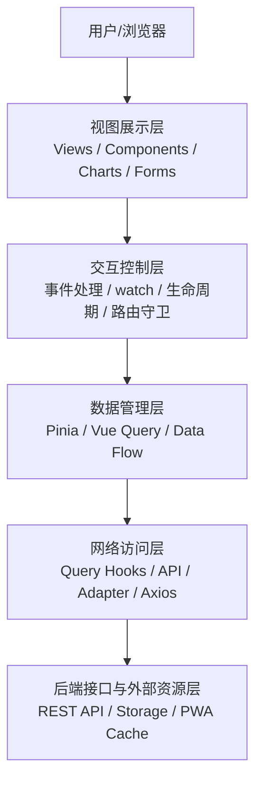
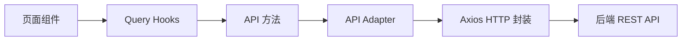
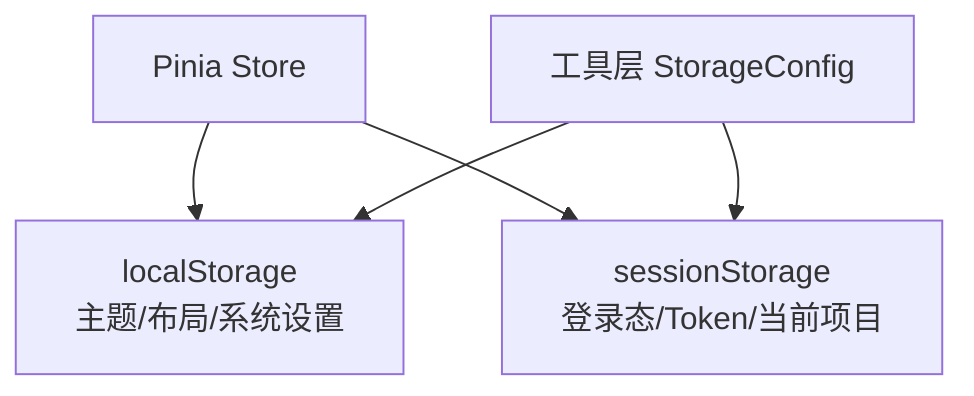
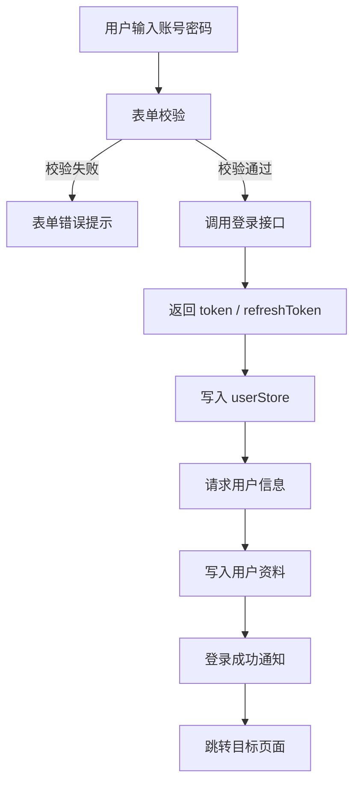
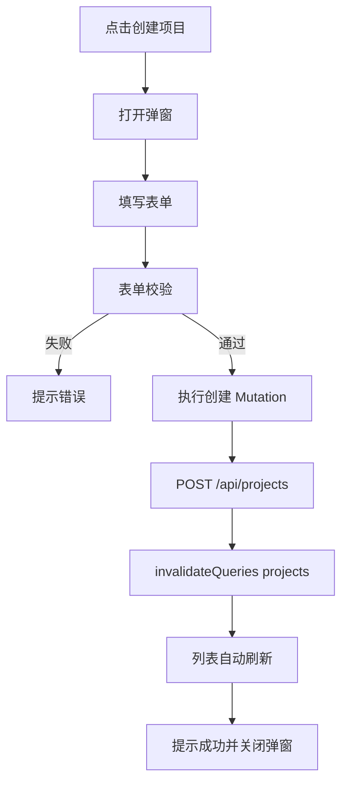
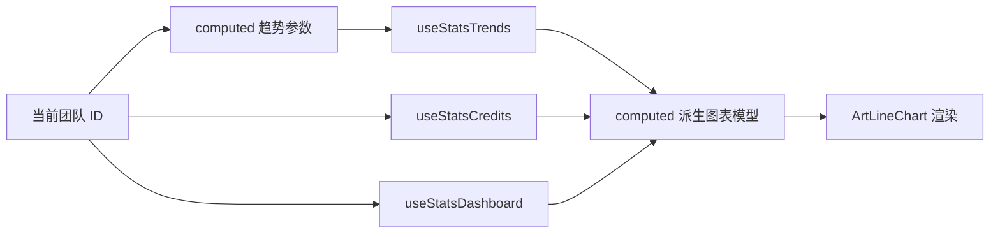
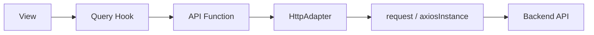
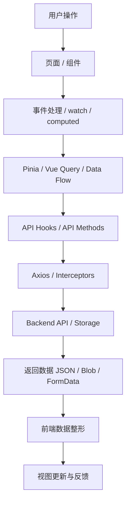
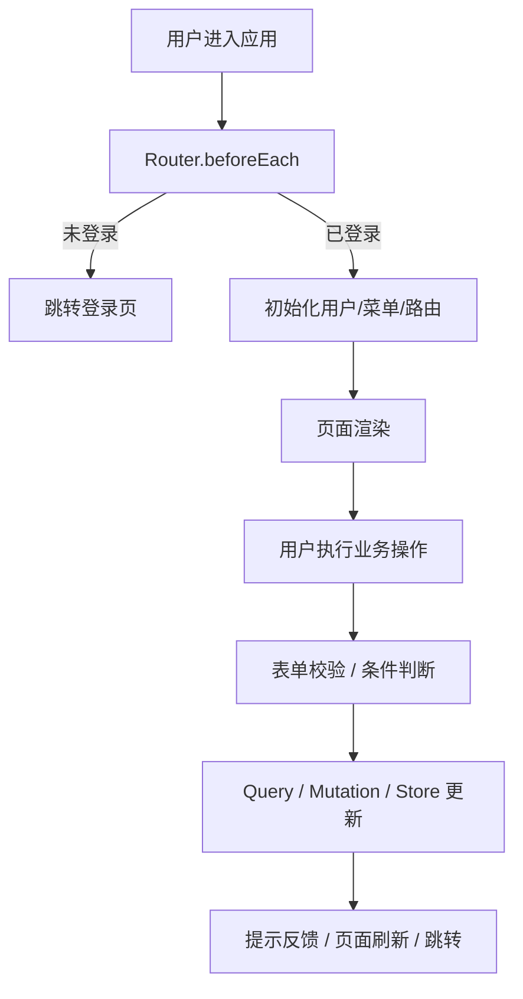
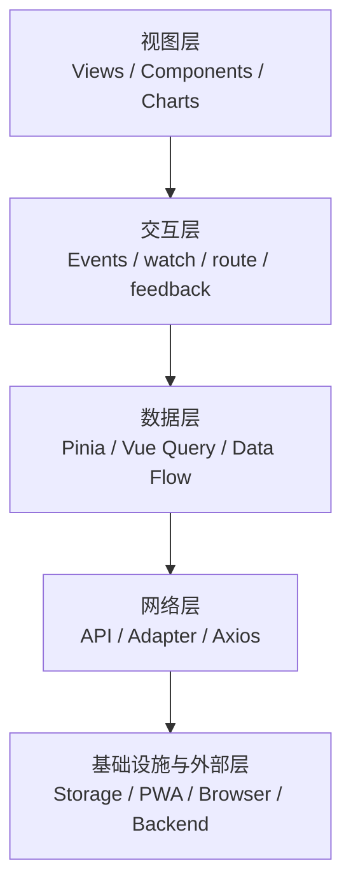

# Dreamcraft Astra 前端技术架构分析报告（正式汇报版）

> **报告日期**：2026 年 6 月 6 日  
> **项目名称**：Dreamcraft Astra  
> **报告类型**：前端技术架构正式分析报告  
> **分析范围**：数据处理流程、前端分层结构、交互机制、系统关系、维护性与扩展性评估

---

# 一、项目概况

Dreamcraft Astra 是一个基于 **Vue 3、TypeScript 与 Vite** 构建的中大型前端业务平台，业务范围覆盖用户认证、项目管理、团队协作、脚本管理、分镜设计、素材管理、视频生成、积分计费、统计分析以及系统管理等多个功能域。

从当前代码结构与运行机制来看，项目已经形成了较为完整的前端架构体系，具备以下典型特征：

- 业务域划分清晰
- 数据获取链路统一
- 客户端状态与服务端状态边界明确
- 网络访问治理集中
- 组件体系较为完善
- 工程化与性能优化能力较成熟

本报告围绕项目当前前端实现，重点分析其数据处理机制、系统分层结构、核心交互链路以及架构层面的维护与扩展表现。

---

# 二、技术架构总体说明

## 2.1 技术栈构成

### 核心框架
- Vue 3
- TypeScript
- Vite

### 状态与数据管理
- Pinia
- pinia-plugin-persistedstate
- TanStack Vue Query

### 视图与样式体系
- Element Plus
- Tailwind CSS
- SCSS

### 网络访问与通信能力
- Axios
- 自定义 HTTP 请求封装
- API Adapter 抽象层

### 图表、文件与媒体能力
- ECharts
- WangEditor
- xgplayer
- xlsx
- file-saver
- vue-img-cutter

### 工程化与运行增强能力
- vite-plugin-pwa
- vite-plugin-compression
- unplugin-auto-import
- unplugin-vue-components
- web-vitals

---

## 2.2 前端总体架构图



该架构体现出清晰的前端纵向分层：由用户输入触发页面交互，经由状态管理与网络访问层完成数据获取，再回流至视图层进行渲染与反馈。

---

# 三、数据处理流程分析

## 3.1 数据获取机制

项目当前的数据获取机制主要由三类构成：

1. **后端 API 接口调用**
2. **本地存储读取与持久化恢复**
3. **第三方库与浏览器能力集成**

---

### 3.1.1 API 接口调用机制

API 接口调用是项目最核心的数据来源，覆盖用户信息、项目数据、团队数据、统计数据、审核数据、脚本与分镜数据、积分记录等主要业务信息。

当前项目采用分层式调用结构，调用链路如下：



### 调用分层说明

#### 页面组件层
页面组件只负责触发查询或变更，不直接依赖底层 HTTP 请求实现。

#### Query Hooks 层
位于 `src/api/queries/*`，主要职责包括：
- 封装查询逻辑
- 提供 loading / error / success 状态
- 管理缓存与失效刷新
- 根据响应式参数自动发起请求

#### API 方法层
位于 `src/api/*`，负责：
- 定义接口路径
- 约束入参与返回值类型
- 统一调用适配器发起请求

#### Adapter 层
位于 `src/api/adapter/*`，负责将业务 API 与底层请求实现隔离。

#### HTTP 封装层
位于 `src/utils/http/*`，负责：
- token 注入
- 错误转换
- 自动刷新令牌
- 请求去重
- 响应缓存
- 超时与重试处理

---

### 3.1.2 本地存储读取机制

项目使用 `localStorage` 与 `sessionStorage` 作为运行期本地数据持久化手段。

#### localStorage 用途
主要用于持久化较长期的用户偏好型数据，例如：
- 主题模式
- 菜单布局配置
- 系统设置项

#### sessionStorage 用途
主要用于持久化当前会话内有效的数据，例如：
- 登录状态
- accessToken / refreshToken
- 当前项目 ID
- 部分路由或 iframe 临时缓存

### 本地存储治理方式

项目通过以下机制统一管理持久化：
- `pinia-plugin-persistedstate`
- `StorageKeyManager`
- `StorageConfig`

### 存储分布示意图



---

### 3.1.3 第三方能力与浏览器能力集成

除后端 API 外，项目还集成了一系列第三方前端能力与浏览器原生能力，用于辅助数据处理与表现。

#### 图表能力
- 基于 ECharts 渲染统计趋势、排名、分析结果等可视化信息。

#### 富文本能力
- 基于 WangEditor 处理文本编辑类业务内容。

#### 文件处理能力
- 基于 `xlsx` 完成 Excel 数据导入导出。
- 基于 `file-saver` 处理文件下载。
- 基于 `FormData` 进行文件上传。

#### 媒体能力
- 使用 `xgplayer` 进行视频播放。
- 使用 `vue-img-cutter` 进行图片裁剪。

#### 性能采集能力
- 使用 `web-vitals` 进行关键性能指标监控。

#### PWA 缓存能力
- 使用 `vite-plugin-pwa` 为静态资源及指定 API 请求提供离线缓存策略。

---

## 3.2 数据传输方式与通信协议

### 3.2.1 组件与模块间数据传输方式

项目中的数据在不同层之间主要通过以下方式传输：

#### 1. Vue 响应式系统
依赖：
- `ref`
- `reactive`
- `computed`
- `watch`

用于实现组件内部和局部逻辑的数据驱动。

#### 2. Props / Emits
组件间通过 Props 与事件进行显式通信，用于父子组件的数据传递和交互回调。

#### 3. Pinia 全局状态共享
用于跨页面共享：
- 用户信息
- 当前团队上下文
- 当前项目上下文
- 系统设置
- 菜单状态与标签页状态

#### 4. Vue Query 缓存共享
多个组件可复用同一查询结果，实现：
- 数据缓存复用
- 请求合并语义
- mutation 后统一刷新

#### 5. Data Flow 平台
项目中存在独立的数据流治理能力，用于：
- 数据通道注册
- 数据发送与订阅
- 转换器链处理
- 流程监控与告警
- 可视化展示

---

### 3.2.2 通信协议与数据格式

当前项目与后端主要通过 **HTTP/HTTPS + RESTful API** 方式通信。

#### 主要数据格式
- JSON：通用业务数据
- Blob：导出文件流
- FormData：上传文件数据

#### 典型接口形式
- `GET /api/projects`
- `POST /api/projects`
- `PUT /api/projects/{id}`
- `GET /api/statistics/dashboard`
- `GET /api/statistics/teams/{teamId}/trends`

#### 开发环境通信方式
Vite 通过代理将 `/api` 请求转发至目标后端地址，以解决开发环境跨域访问问题。

---

## 3.3 数据安全与请求控制机制

### 3.3.1 Token 认证
Axios 请求拦截器会自动从用户状态中读取令牌，并附加到请求头中：

- `Authorization: Bearer <token>`

### 3.3.2 401 自动刷新机制
HTTP 层实现了完整的授权失效处理策略：
- 并发请求共享同一次刷新流程
- 刷新成功后自动重发等待中的请求
- 刷新失败则清理登录态并跳转登录页

### 3.3.3 请求超时与失败重试
项目当前设置了统一超时与有限重试策略：
- 请求超时：15 秒
- 最大重试：1 次

### 3.3.4 请求去重与响应缓存
项目在 HTTP 层实现了：
- 基于请求 key 的请求去重
- 基于 LRU 的响应缓存

### 3.3.5 表单输入校验
在用户交互侧，项目普遍使用 `ElForm + rules` 进行前端校验，包括：
- 必填校验
- 长度校验
- 格式约束
- 提交前校验拦截

### 3.3.6 本地敏感数据处理
锁屏密码通过浏览器原生加密能力执行 SHA-256 摘要处理，避免明文落盘。

---

## 3.4 用户与系统的数据交互流程

### 3.4.1 登录流程



登录交互链路体现出典型的“前端输入校验 → 登录认证 → 用户信息补全 → 页面跳转”闭环。

---

### 3.4.2 项目列表查询流程

```mermaid
flowchart TD
    A[用户输入搜索/筛选条件] --> B[computed 生成 queryParams]
    B --> C[useProjectList(queryParams)]
    C --> D[Vue Query 发起查询]
    D --> E[后端返回 records / total]
    E --> F[组件 computed 二次整理]
    F --> G[卡片/列表视图渲染]
```

该流程显示出前端将查询条件控制在页面层，而分页结果与记录集由服务端负责返回，前端只进行必要的映射与展示。

---

### 3.4.3 项目创建流程



---

### 3.4.4 仪表盘图表数据流



图表模块普遍采用多接口数据聚合 + computed 映射的模式，将原始响应数据转化为图表可直接使用的展示结构。

---

# 四、前端架构分层解析

## 4.1 视图层

### 4.1.1 页面层结构

项目页面主要位于 `src/views` 目录下，并按业务域组织，例如：

- `auth`
- `dashboard`
- `project`
- `team`
- `script`
- `storyboard`
- `asset`
- `video-gen`
- `stats`
- `system`
- `workflow`
- `notice`

该结构具备较强的业务可读性与目录可维护性。

### 4.1.2 组件层结构

项目组件主要分为三类：

#### 核心通用组件
位于 `src/components/core`，包括：
- 基础组件
- 表单组件
- 表格组件
- 图表组件
- 布局组件
- 媒体组件
- 卡片组件

#### 业务组件
位于 `src/components/business`，承载特定业务流程，例如引导弹窗等。

#### 页面私有模块组件
位于各视图目录下的 `modules` 或 `components` 中，用于支撑特定页面逻辑。

### 4.1.3 视图渲染机制

项目采用 Vue 3 单文件组件机制：
- `template` 负责结构定义
- `script setup` 负责页面逻辑
- `style scoped` / `scss` 负责样式实现

页面最终通过 `App.vue` 中的 `RouterView` 统一渲染。

### 4.1.4 视觉实现方式

项目的视觉实现基于以下组合：

- Element Plus：承担主要业务组件展示
- Tailwind CSS：承担快速布局与原子化样式控制
- SCSS：承担主题、结构和复杂样式
- ECharts：承担图表可视化表达

---

## 4.2 数据层

### 4.2.1 状态管理结构

项目的数据层主要由三个部分组成：

1. **Pinia**：客户端运行时状态
2. **Vue Query**：服务端异步状态
3. **Data Flow 平台**：数据流治理与观测能力

### 4.2.2 Pinia 管理范围

Pinia 主要管理以下客户端状态：
- 登录状态
- 用户资料
- 当前团队 ID
- 当前项目 ID
- 系统设置
- 菜单状态
- 工作标签页状态

### 4.2.3 Vue Query 管理范围

Vue Query 主要管理以下服务端状态：
- 项目列表与详情
- 团队与成员列表
- 统计分析数据
- 分镜与脚本数据
- 资产数据
- 通知与审核数据

### 4.2.4 数据持久化策略

当前持久化策略如下：

| 数据类型 | 存储方式 |
|---|---|
| 主题与系统设置 | localStorage |
| 登录态与 token | sessionStorage |
| 当前项目上下文 | sessionStorage |
| Vue Query 缓存 | 内存缓存 |

### 4.2.5 数据缓存策略

#### Vue Query 层
- `staleTime`
- `gcTime`
- `enabled`
- `invalidateQueries`

#### HTTP 层
- 请求去重
- LRU 响应缓存

#### PWA 层
- `NetworkFirst` 运行时缓存策略

---

## 4.3 交互层

### 4.3.1 用户操作处理方式

项目主要通过以下机制响应用户操作：
- `@click`
- `@keyup.enter`
- `v-model`
- `watch`
- `router.push`
- `mutation.mutateAsync`

### 4.3.2 事件响应机制

交互事件处理主要分为三种层级：

#### 页面局部事件
由模板直接触发 handler，完成按钮点击、输入提交、弹窗开关等操作。

#### 响应式联动事件
通过 `watch` 监听查询参数或异步数据变化，实现：
- 页码重置
- 数据同步
- 条件弹窗显示

#### 全局导航事件
通过路由守卫完成：
- 登录校验
- 动态路由初始化
- 页面标题处理
- 异常页跳转

### 4.3.3 交互反馈机制

项目当前已建立较完整的用户反馈机制：

- `ElMessage`：轻量提示
- `ElNotification`：通知提示
- `ElMessageBox`：确认对话框
- `loadingService`：加载提示
- `NProgress`：路由进度条
- 全局错误边界与异常页：错误反馈与兜底

---

## 4.4 路由层

### 4.4.1 路由实现方式

项目使用：
- `createRouter`
- `createWebHashHistory`

说明当前应用采用 Hash 路由模式。

### 4.4.2 路由层承担的职责

全局路由前置守卫负责：
- 登录态检查
- 动态路由注册
- 菜单数据处理
- 用户信息加载
- 团队上下文预处理
- 页面标题设置
- 标签页维护
- 初始化失败兜底

路由层在当前项目中承担了较强的应用初始化调度职责。

---

## 4.5 网络层

### 4.5.1 网络结构



### 4.5.2 网络层职责划分

#### Query Hook 层
负责请求触发时机、缓存、失效刷新和异步状态暴露。

#### API Function 层
负责定义接口路径、入参与返回值类型。

#### Adapter 层
负责屏蔽底层请求实现差异。

#### Axios 层
负责认证、错误处理、请求去重、缓存与重试策略。

### 4.5.3 错误处理机制

网络层已形成较完整的错误处理体系：
- 自定义 `HttpError`
- 业务码与 HTTP 状态码分层处理
- 登录失败映射业务提示语
- 全局失败与局部失败配合处理

---

## 4.6 工具层与基础设施层

项目工具层位于 `src/utils`，主要包括：

- `http`
- `router`
- `storage`
- `navigation`
- `ui`
- `sys`
- `data-flow`

### 主要职责

#### 存储治理
- key 统一管理
- 存储兼容性检查
- 持久化配置支持

#### UI 支撑
- 全局 loading
- 动画控制
- 主题初始化与切换

#### 系统支撑
- web-vitals 初始化
- 升级逻辑
- 全局错误处理

#### 数据流治理
- 通道注册
- 转换器管理
- 监控告警
- 可视化输出

---

# 五、系统关系图与结构图

## 5.1 数据流向总图



## 5.2 用户交互路径图



## 5.3 前端分层关系图



---

# 六、当前架构优势分析

## 6.1 分层结构较清晰

当前项目在视图、交互、状态、接口、网络与工具层之间建立了较明确的职责边界，有利于控制代码复杂度。

## 6.2 数据访问链路统一

所有接口访问均通过 Query Hook → API Function → Adapter → Axios 的统一链路执行，便于规范化维护。

## 6.3 状态管理边界较合理

项目较好地区分了：
- 客户端上下文状态
- 服务端查询状态
- 数据流治理能力

这使得 store 不会过度膨胀，也降低了异步状态管理混乱的风险。

## 6.4 交互反馈体系完整

项目覆盖了通知、轻提示、确认框、加载态、路由进度与错误页等多类反馈机制，用户体验基础较为完整。

## 6.5 工程化与性能优化能力较强

项目已具备：
- 自动导入
- 组件按需加载
- 构建压缩
- PWA 支持
- 手动分包
- 请求缓存与去重
- 页面性能指标采集

---

# 七、潜在改进点分析

## 7.1 路由守卫职责偏重

当前前置守卫承担了登录、初始化、动态路由、菜单处理、页面标题、错误兜底等多项任务，后续随着业务扩展，入口复杂度可能继续上升。

## 7.2 页面级逻辑仍有进一步抽象空间

部分页面同时负责：
- 查询参数构造
- 视图模型映射
- mutation 操作
- UI 反馈处理

后续可进一步抽离为页面级 composable 或独立业务服务层。

## 7.3 Data Flow 平台需要持续制度化落地

当前项目已具备数据流治理能力，但仍需要在业务接入深度、统一使用规范和可视化利用率方面持续完善。

## 7.4 本地存储策略可以继续精细化

虽然目前已区分 localStorage 与 sessionStorage，但仍可继续明确不同类型数据的保留周期与安全边界。

---

# 八、可维护性评估

## 8.1 有利因素

- 项目目录结构清晰
- TypeScript 类型约束较充分
- API 调用路径统一
- Vue Query 减轻异步状态管理复杂度
- HTTP 层集中处理认证与错误逻辑

## 8.2 风险因素

- 路由入口逻辑复杂度偏高
- 多业务域并行演进对规范要求较高
- 页面局部逻辑可能随功能增长而堆积
- 自定义数据流治理能力增加团队理解门槛

## 8.3 评估结论

当前项目整体可维护性表现较好，已经具备较稳定的中大型前端工程结构。后续重点在于复杂逻辑的进一步拆分与治理规则的持续收敛。

---

# 九、可扩展性评估

## 9.1 有利因素

- 业务域目录结构支持模块持续扩张
- Query Hook 模式具备良好复用性
- 网络访问层抽象统一，新增接口接入成本低
- 组件体系较丰富，可支撑复杂页面快速装配
- 系统设置、布局与主题能力具有延展空间

## 9.2 潜在限制

- 若新模块继续复用重型路由初始化逻辑，入口复杂度会不断提升
- 若 Data Flow、Pinia、Vue Query 三者边界缺乏持续约束，未来可能带来认知负担

## 9.3 评估结论

当前项目具备较强的可扩展性，能够继续承载更多业务模块、更多分析页面以及更复杂的平台功能。

---

# 十、结论

综合分析，Dreamcraft Astra 当前前端项目已形成较完整的技术架构体系，在数据处理链路、组件层级组织、状态管理边界、网络治理能力和工程化建设方面均表现出较高成熟度。

项目现阶段具备以下总体特征：

- 架构主干清晰，分层合理
- 数据访问与缓存机制统一
- 视图与交互组织方式较规范
- 网络通信与安全控制较完整
- 具备较好的可维护性与可扩展性基础

在后续持续演进过程中，建议重点关注路由初始化复杂度控制、页面级逻辑抽离、数据流治理规范化以及本地存储策略细化等方向，以进一步提升系统长期演进质量。
