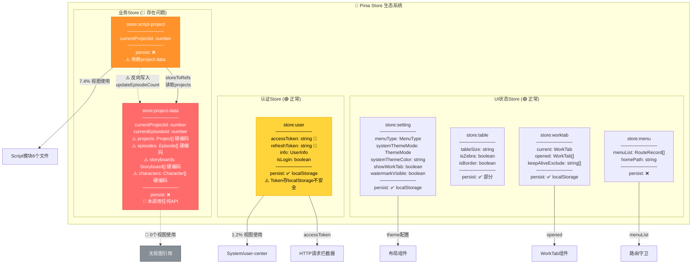
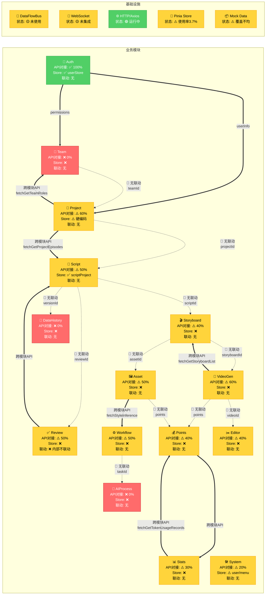
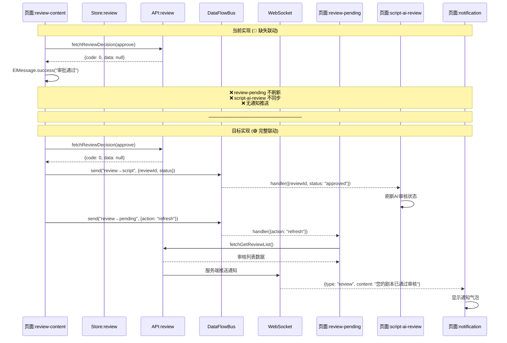
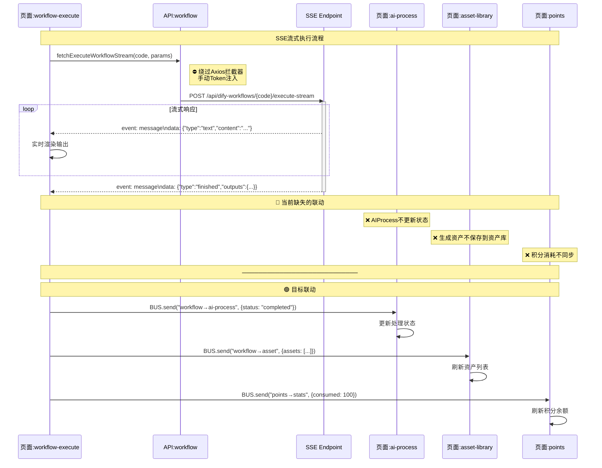

# DreamCraft Astra 项目数据流转架构流程图

> 生成日期: 2026-05-30  
> 项目: DreamCraft Astra (art-design-pro)  
> 技术栈: Vue 3.5 + Pinia 3 + Axios 1 + TypeScript 5.6  

---

## 图例说明

### 符号定义

| 符号 | 含义 | 说明 |
|------|------|------|
| `──▶` | 同步数据流 | 请求-响应模式，调用方阻塞等待 |
| `- -▶` | 异步数据流 | 事件驱动/回调模式，非阻塞 |
| `══▶` | 双向数据流 | 读写双向交互 |
| `◇◇▶` | 广播数据流 | 一对多推送 |
| `🔴` | 阻塞点 | 资源竞争/依赖等待 |
| `⛔` | 断路点 | 连接失败/权限限制 |
| `⚠️` | 风险点 | 数据不一致/类型冲突 |
| `🟡` | 未实现 | 已设计未集成 |
| `🟢` | 已实现 | 功能完整可用 |

### 数据类型标注

| 标注 | 类型 | 示例 |
|------|------|------|
| `<T>` | 泛型数据 | `PaginatedResponse<Project>` |
| `<E>` | 事件数据 | `SSEEvent / WSMessage` |
| `<S>` | 状态数据 | `Ref<T> / Reactive<T>` |
| `<CMD>` | 命令数据 | `CreateProjectDTO / UpdateScriptDTO` |

### 模块命名规范

| 前缀 | 含义 | 示例 |
|------|------|------|
| `api:` | API服务层 | `api:project`, `api:script` |
| `store:` | Pinia Store层 | `store:user`, `store:project-data` |
| `page:` | 视图页面层 | `page:project-list`, `page:review-pending` |
| `comp:` | 组件层 | `comp:storyboard-panel`, `comp:video-player` |
| `bus:` | 数据总线层 | `bus:data-flow`, `bus:mitt-event` |
| `ws:` | WebSocket层 | `ws:notification` |
| `mock:` | 模拟数据层 | `mock:modules`, `mock:auth` |

---

## 图1: 系统整体架构层级图

```mermaid
graph TB
    subgraph CLIENT["🖥️ 客户端层 (Browser)"]
        direction TB
        subgraph VIEWS["📋 视图层 (Views - 14个模块/81个文件)"]
            AUTH["🔐 Auth<br/>login / register<br/>forget-password / join-team"]
            DASH["📊 Dashboard<br/>console / usage / analysis<br/>report / ai-usage / cost"]
            PROJ["📁 Project<br/>list / edit / episodes<br/>characters / scripts / member / statistics"]
            SCRP["📝 Script<br/>library / version / profiles<br/>decompose / ai-review / write"]
            SBRD["🎬 Storyboard<br/>design / batch-edit<br/>scene / preview"]
            VGEN["🎥 VideoGen<br/>task / ai / history / preview"]
            EDIT["✂️ Editor<br/>edit-manage / export / timeline"]
            ASSET["🖼️ Asset<br/>library / ai-generate / preview<br/>reuse / tags / upload / category / import"]
            REVW["✅ Review<br/>pending / content / flow<br/>reject-reasons / statistics / detail"]
            TEAM["👥 Team<br/>list / settings / members<br/>roles / invite-codes / applications / quota"]
            WF["⚙️ Workflow<br/>list / execute / catalog"]
            AIP["🤖 AIProcess<br/>status / history"]
            DH["📜 DataHistory<br/>records / rollback"]
            PTS["💰 Points<br/>token-usage / transactions<br/>pricing / billing / record"]
            SYS["🛠️ System<br/>user / role / menu / dify-workflows<br/>video-models / billing-config / ..."]
            NOTIF["🔔 Notification<br/>site / remind"]
        end

        subgraph COMPS["🧩 组件层 (Components)"]
            CORE_COMP["核心组件<br/>ArtTable / ArtForm / ArtSearchBar"]
            MEDIA_COMP["媒体组件<br/>ArtVideoPlayer / ArtStoryboardPanel<br/>ArtCutterImg"]
            LAYOUT_COMP["布局组件<br/>ArtMenus / ArtHeaderBar<br/>ArtWorkTab / ArtNotification"]
            CHART_COMP["图表组件<br/>ArtBarChart / ArtLineChart<br/>ArtRingChart / ArtRadarChart"]
        end
    end

    subgraph STATE["💾 状态管理层 (Pinia Store - 7个模块)"]
        direction LR
        S_USER["store:user<br/>accessToken / info / isLogin"]
        S_SETTING["store:setting<br/>27+ UI配置项"]
        S_TABLE["store:table<br/>表格样式配置"]
        S_MENU["store:menu<br/>menuList / homePath"]
        S_WORKTAB["store:worktab<br/>opened / current"]
        S_PROJ_DATA["store:project-data<br/>⚠️ 硬编码Mock数据<br/>projects / episodes / storyboards"]
        S_SCRIPT_PROJ["store:script-project<br/>⚠️ 依赖project-data<br/>currentProjectId"]
    end

    subgraph DATALOW["🔄 数据流转层 (DataFlowBus - 🟡已注册未使用)"]
        BUS["DataFlowBus<br/>10个内置通道 + 1个事件总线"]
        CHANNEL["DataChannelManager<br/>通道注册/查询/销毁"]
        TRANSFORMER["DataTransformerManager<br/>pagination-response<br/>sanitize-empty<br/>date-format"]
        MONITOR["DataFlowMonitor<br/>指标采集 / 告警规则<br/>滑动窗口60s"]
        VISUAL["DataFlowVisualizer<br/>Mermaid / JSON / Console"]
    end

    subgraph COMMS["🌐 通信层 (HTTP / WS / SSE)"]
        HTTP["HTTP Client (Axios)<br/>🟢 拦截器 / 401防抖<br/>🔴 重试MAX=0未启用"]
        WS["WebSocket Client<br/>🟡 已实现未集成<br/>心跳5s / 重连指数退避"]
        SSE["SSE Stream (原生fetch)<br/>🟢 Workflow流式执行<br/>⛔ 绕过拦截器链"]
    end

    subgraph SERVER["☁️ 服务端层"]
        API_REST["REST API<br/>/api/* 200+接口<br/>24个模块"]
        API_SSE["SSE Endpoint<br/>/api/dify-workflows/*/execute-stream"]
        API_WS["WebSocket Server<br/>🟡 未集成"]
    end

    VIEWS --> STATE
    VIEWS --> COMMS
    COMPS --> STATE
    STATE --> DATALOW
    COMMS --> SERVER

    style S_PROJ_DATA fill:#ff6b6b,stroke:#c92a2a,color:#fff
    style S_SCRIPT_PROJ fill:#ff6b6b,stroke:#c92a2a,color:#fff
    style BUS fill:#ffd43b,stroke:#f59f00,color:#000
    style WS fill:#ffd43b,stroke:#f59f00,color:#000
    style SSE fill:#ff922b,stroke:#e67700,color:#fff
    style HTTP fill:#51cf66,stroke:#2f9e44,color:#fff
```



---

## 图2: 核心业务模块数据流转图

```mermaid
graph LR
    subgraph AUTH_MODULE["🔐 认证模块"]
        AUTH_API["api:auth<br/>12个接口"]
        AUTH_STORE["store:user<br/>accessToken / info"]
        AUTH_PAGE["page:login<br/>page:register<br/>page:forget-password"]
    end

    subgraph TEAM_MODULE["👥 团队模块"]
        TEAM_API["api:team<br/>22个接口"]
        TEAM_PAGE["page:team-list<br/>page:team-members<br/>page:team-roles<br/>page:team-settings<br/>page:team-invite-codes<br/>page:team-applications<br/>page:team-quota"]
    end

    subgraph PROJ_MODULE["📁 项目模块"]
        PROJ_API["api:project<br/>20个接口"]
        PROJ_PAGE["page:project-list<br/>page:project-edit<br/>page:project-episodes<br/>page:project-characters<br/>page:project-scripts<br/>page:project-member<br/>page:project-statistics"]
        PROJ_STORE["store:project-data<br/>⚠️ 硬编码数据"]
    end

    subgraph SCRIPT_MODULE["📝 剧本模块"]
        SCRIPT_API["api:script<br/>22个接口"]
        SCRIPT_PAGE["page:script-library<br/>page:script-version<br/>page:script-profiles<br/>page:script-decompose<br/>page:script-ai-review<br/>page:script-write"]
        SCRIPT_STORE["store:script-project<br/>⚠️ 依赖project-data"]
    end

    subgraph SBRD_MODULE["🎬 分镜模块"]
        SBRD_API["api:storyboard<br/>17个接口"]
        SBRD_PAGE["page:storyboard-design<br/>page:storyboard-batch-edit<br/>page:storyboard-scene<br/>page:storyboard-preview"]
    end

    subgraph ASSET_MODULE["🖼️ 资产模块"]
        ASSET_API["api:asset<br/>20个接口"]
        ASSET_PAGE["page:asset-library<br/>page:asset-ai-generate<br/>page:asset-preview<br/>page:asset-reuse<br/>page:asset-tags"]
    end

    subgraph REVIEW_MODULE["✅ 审核模块"]
        REVIEW_API["api:review<br/>17个接口"]
        REVIEW_PAGE["page:review-pending<br/>page:review-content<br/>page:review-flow<br/>page:review-statistics"]
    end

    subgraph VIDEO_MODULE["🎥 视频生成模块"]
        VIDEO_API["api:video<br/>8个接口"]
        VIDEO_PAGE["page:video-task<br/>page:video-ai<br/>page:video-history<br/>page:video-preview"]
    end

    AUTH_API ──▶|"login<T>"| AUTH_STORE
    AUTH_STORE ──▶|"userInfo<S>"| AUTH_PAGE
    AUTH_API ──▶|"permissions<T>"| AUTH_STORE

    TEAM_API ──▶|"teamList<T>"| TEAM_PAGE
    PROJ_API ──▶|"projectList<T>"| PROJ_PAGE
    PROJ_STORE ──▶|"⚠️ 硬编码数据<S>"| PROJ_PAGE
    SCRIPT_API ──▶|"scriptList<T>"| SCRIPT_PAGE
    SCRIPT_STORE ──▶|"⚠️ 硬编码数据<S>"| SCRIPT_PAGE
    SBRD_API ──▶|"storyboardList<T>"| SBRD_PAGE
    ASSET_API ──▶|"assetList<T>"| ASSET_PAGE
    REVIEW_API ──▶|"reviewList<T>"| REVIEW_PAGE
    VIDEO_API ──▶|"videoTaskList<T>"| VIDEO_PAGE

    PROJ_PAGE -.->|"🔴 无联动<br/>projectId<CMD>"| SCRIPT_PAGE
    SCRIPT_PAGE -.->|"🔴 无联动<br/>scriptId<CMD>"| SBRD_PAGE
    SBRD_PAGE -.->|"🔴 无联动<br/>storyboardId<CMD>"| VIDEO_PAGE
    REVIEW_PAGE -.->|"🔴 无联动<br/>审批结果<E>"| REVIEW_PAGE
    TEAM_PAGE -.->|"🔴 无联动<br/>teamId<CMD>"| PROJ_PAGE

    PROJ_PAGE ==>|"跨模块API调用<br/>fetchGetProjectEpisodes<T>"| SCRIPT_API
    PROJ_PAGE ==>|"跨模块API调用<br/>fetchGetTeamRoles<T>"| TEAM_API
    VIDEO_PAGE ==>|"跨模块API调用<br/>fetchGetStoryboardList<T>"| SBRD_API
    ASSET_PAGE ==>|"跨模块API调用<br/>fetchStyleInference<T>"| WF_API_EXT

    SCRIPT_STORE -.->|"⚠️ 反向写入<br/>updateEpisodeCount<CMD>"| PROJ_STORE

    style PROJ_STORE fill:#ff6b6b,stroke:#c92a2a,color:#fff
    style SCRIPT_STORE fill:#ff6b6b,stroke:#c92a2a,color:#fff
```

---

## 图3: 通信层架构与数据流转图

```mermaid
graph TB
    subgraph VIEW_LAYER["📋 视图层"]
        PAGE_A["页面组件 A"]
        PAGE_B["页面组件 B"]
        PAGE_C["页面组件 C"]
    end

    subgraph STORE_LAYER["💾 Store层"]
        USER_STORE["store:user<br/>accessToken: string<br/>info: UserInfo<br/>isLogin: boolean"]
        PROJ_STORE["store:project-data<br/>⚠️ projects: Project[]<br/>⚠️ episodes: Episode[]<br/>⚠️ storyboards: Storyboard[]<br/>⚠️ characters: Character[]"]
        SCRIPT_STORE["store:script-project<br/>currentProjectId: number"]
    end

    subgraph HTTP_LAYER["🌐 HTTP通信层 (Axios)"]
        REQ_INTER["请求拦截器<br/>🟢 Token注入<br/>🟢 Content-Type设置"]
        RES_INTER["响应拦截器<br/>🟢 业务code检查<br/>🟢 401防抖(3s)<br/>🟢 统一错误处理"]
        RETRY["重试机制<br/>🔴 MAX_RETRIES=0<br/>🔴 未启用<br/>可重试: 408/500/502/503/504"]
        ERROR_HANDLER["错误处理<br/>🟢 HttpError封装<br/>🟢 消息提示<br/>🟢 401自动登出(500ms延迟)"]
    end

    subgraph SSE_LAYER["📡 SSE通信层 (原生fetch)"]
        SSE_REQ["SSE请求<br/>🟢 fetch API<br/>⛔ 绕过Axios拦截器<br/>⛔ 手动Token注入"]
        SSE_READ["SSE读取<br/>🟢 ReadableStream<br/>🟢 getReader()"]
        SSE_PARSE["SSE解析<br/>🟢 逐行解析event/data"]
    end

    subgraph WS_LAYER["🔌 WebSocket通信层"]
        WS_CONN["WS连接<br/>🟡 已实现未集成<br/>🟢 单例模式<br/>🟢 连接超时10s"]
        WS_HEART["心跳机制<br/>🟢 检测间隔5s<br/>🟢 Ping间隔10s"]
        WS_RECONN["重连机制<br/>🟢 指数退避<br/>🟢 最大10次<br/>🟢 随机抖动0~1s"]
        WS_QUEUE["消息队列<br/>🟢 连接前缓存<br/>🟢 连接后flush"]
    end

    subgraph SERVER_LAYER["☁️ 服务端"]
        REST_API["REST API<br/>/api/*"]
        SSE_EP["SSE Endpoint<br/>/api/dify-workflows/*/execute-stream"]
        WS_EP["WebSocket Server<br/>🟡 未集成"]
    end

    PAGE_A ──▶|"GET/POST/PUT/DELETE<br/><CMD>/<T>"| REQ_INTER
    PAGE_B ──▶|"SSE流式请求<br/><CMD>"| SSE_REQ
    PAGE_C ──▶|"🟡 WebSocket<br/><E>"| WS_CONN

    REQ_INTER ──▶|"Authorization: Bearer xxx"| RES_INTER
    RES_INTER ──▶|"code===0: data<T>"| PAGE_A
    RES_INTER ──▶|"code===401: 🔴 触发登出"| USER_STORE
    RES_INTER -.->|"5xx: 🔴 重试(未启用)"| RETRY
    RETRY -.->|"重试失败"| ERROR_HANDLER

    SSE_REQ ──▶|"⛔ 无拦截器<br/>手动Token"| SSE_EP
    SSE_EP ──▶|"event: message<br/>data: <E>"| SSE_READ
    SSE_READ ──▶|"SSEEvent<E>"| SSE_PARSE
    SSE_PARSE ──▶|"流式数据<E>"| PAGE_B

    WS_CONN ──▶|"🟡"| WS_EP
    WS_CONN ──▶|"🟢 ping/pong"| WS_HEART
    WS_HEART ──▶|"连接断开"| WS_RECONN
    WS_CONN ──▶|"消息入队"| WS_QUEUE
    WS_QUEUE ──▶|"连接后flush"| WS_CONN

    USER_STORE ──▶|"accessToken"| REQ_INTER

    style RETRY fill:#ff6b6b,stroke:#c92a2a,color:#fff
    style SSE_REQ fill:#ff922b,stroke:#e67700,color:#fff
    style WS_CONN fill:#ffd43b,stroke:#f59f00,color:#000
    style WS_EP fill:#ffd43b,stroke:#f59f00,color:#000
    style PROJ_STORE fill:#ff6b6b,stroke:#c92a2a,color:#fff
```

---

## 图4: Store状态流转与依赖关系图



---

## 图5: DataFlowBus通道架构图

```mermaid
graph TB
    subgraph DATAFLOW_BUS["🔄 DataFlowBus 统一数据流转平台"]
        direction TB

        subgraph API_TO_PAGE["API → 页面 (单向通道 × 6)"]
            CH1["flow:api→project-list<br/>───────────<br/>源: api:project<br/>目标: page:project-list<br/>方向: ONE_WAY<br/>转换器: pagination-response"]
            CH2["flow:api→script-list<br/>───────────<br/>源: api:script<br/>目标: page:script-list<br/>方向: ONE_WAY<br/>转换器: pagination-response"]
            CH3["flow:api→asset-list<br/>───────────<br/>源: api:asset<br/>目标: page:asset-library<br/>方向: ONE_WAY<br/>转换器: pagination-response"]
            CH4["flow:api→review-list<br/>───────────<br/>源: api:review<br/>目标: page:review-pending<br/>方向: ONE_WAY<br/>转换器: pagination-response"]
            CH5["flow:api→workflow-list<br/>───────────<br/>源: api:workflow<br/>目标: page:workflow-list<br/>方向: ONE_WAY<br/>转换器: pagination-response"]
            CH6["flow:api→team-list<br/>───────────<br/>源: api:team<br/>目标: page:team-list<br/>方向: ONE_WAY<br/>转换器: pagination-response"]
        end

        subgraph STORE_TO_PAGE["Store → 页面 (广播/双向 × 3)"]
            CH7["flow:store→user-info<br/>───────────<br/>源: store:user<br/>目标: page:*<br/>方向: BROADCAST ◇◇▶<br/>转换器: 无"]
            CH8["flow:store→settings<br/>───────────<br/>源: store:setting<br/>目标: component:*<br/>方向: BROADCAST ◇◇▶<br/>转换器: 无"]
            CH9["flow:store→project-data<br/>───────────<br/>源: store:project-data<br/>目标: page:project-*<br/>方向: TWO_WAY ══▶<br/>转换器: 无"]
        end

        subgraph PAGE_TO_API["页面 → API (单向 × 1)"]
            CH10["flow:page→api:form-submit<br/>───────────<br/>源: page:*<br/>目标: api:*<br/>方向: ONE_WAY<br/>转换器: sanitize-empty"]
        end

        subgraph EVENT_BUS["事件总线 (广播 × 1)"]
            CH11["flow:event-bus:global<br/>───────────<br/>源: mitt:global<br/>目标: component:*<br/>方向: BROADCAST ◇◇▶<br/>监控: 关闭"]
        end
    end

    subgraph TRANSFORMERS["🔧 内置转换器"]
        T_PAG["builtin:pagination-response<br/>分页响应转换<br/>API格式 → 页面格式"]
        T_SAN["builtin:sanitize-empty<br/>空值清理<br/>提交前清理空字段"]
        T_DATE["builtin:date-format<br/>日期格式化<br/>ISO → 显示格式"]
        T_PAG_REQ["builtin:pagination-params<br/>分页参数转换<br/>页面参数 → API参数"]
    end

    subgraph MONITOR_SYS["📊 监控告警系统"]
        METRICS["指标采集<br/>───────────<br/>滑动窗口: 60s<br/>采集项: 传输次数/失败次数<br/>平均耗时/P95/吞吐量/错误率"]
        ALERT_RULES["告警规则<br/>───────────<br/>🔴 错误率>50% (ERROR)<br/>🟡 平均耗时>3s (WARNING)<br/>🟡 P95>10s (WARNING)"]
        ALERT_CB["告警回调<br/>───────────<br/>支持多个回调注册<br/>冷却时间防抖"]
    end

    CH1 --> T_PAG
    CH2 --> T_PAG
    CH3 --> T_PAG
    CH4 --> T_PAG
    CH5 --> T_PAG
    CH6 --> T_PAG
    CH10 --> T_SAN

    METRICS --> ALERT_RULES
    ALERT_RULES --> ALERT_CB

    style CH1 fill:#ffd43b,stroke:#f59f00,color:#000
    style CH2 fill:#ffd43b,stroke:#f59f00,color:#000
    style CH3 fill:#ffd43b,stroke:#f59f00,color:#000
    style CH4 fill:#ffd43b,stroke:#f59f00,color:#000
    style CH5 fill:#ffd43b,stroke:#f59f00,color:#000
    style CH6 fill:#ffd43b,stroke:#f59f00,color:#000
    style CH7 fill:#74c0fc,stroke:#1c7ed6,color:#000
    style CH8 fill:#74c0fc,stroke:#1c7ed6,color:#000
    style CH9 fill:#b197fc,stroke:#7048e8,color:#fff
    style CH10 fill:#63e6be,stroke:#0ca678,color:#000
    style CH11 fill:#868e96,stroke:#495057,color:#fff
```



---

## 图6: 阻塞点与断路器分析图

```mermaid
graph TB
    subgraph BLOCKING_POINTS["🔴 阻塞点分析"]
        direction TB

        BP1["🔴 BP-1: Store循环依赖<br/>───────────<br/>script-project ↔ project-data<br/>类型: 依赖等待<br/>影响: currentProjectId类型冲突<br/>number vs string<br/>风险: 数据不一致"]
        BP2["🔴 BP-2: HTTP重试未启用<br/>───────────<br/>MAX_RETRIES=0<br/>类型: 资源竞争<br/>影响: 5xx错误直接失败<br/>无自动恢复能力<br/>风险: 用户体验差"]
        BP3["🔴 BP-3: SSE绕过拦截器<br/>───────────<br/>原生fetch无拦截器<br/>类型: 依赖等待<br/>影响: Token过期无法刷新<br/>错误处理不统一<br/>风险: 流式请求中断"]
        BP4["🔴 BP-4: 写操作无持久化<br/>───────────<br/>23个文件仅本地修改<br/>类型: 资源竞争<br/>影响: 刷新页面数据丢失<br/>多标签页数据不同步<br/>风险: 数据丢失"]
        BP5["🔴 BP-5: 模块间无联动<br/>───────────<br/>81个文件无跨模块通信<br/>类型: 依赖等待<br/>影响: 审批后列表不刷新<br/>项目删除后编辑页不更新<br/>风险: 数据过期"]
    end

    subgraph CIRCUIT_BREAKERS["⛔ 断路点分析"]
        direction TB

        CB1["⛔ CB-1: 401自动登出<br/>───────────<br/>触发: Token过期/无效<br/>行为: 防抖3s + 延迟500ms登出<br/>断路: 所有pending请求失败<br/>恢复: 重新登录<br/>风险: 长表单填写中断"]
        CB2["⛔ CB-2: SSE连接断开<br/>───────────<br/>触发: 网络波动/服务端关闭<br/>行为: 无重连机制<br/>断路: 流式数据丢失<br/>恢复: 手动重新执行<br/>风险: AI工作流中断"]
        CB3["⛔ CB-3: WebSocket未集成<br/>───────────<br/>触发: 通知推送场景<br/>行为: 客户端已实现但未使用<br/>断路: 实时通知不可用<br/>恢复: 轮询替代(未实现)<br/>风险: 通知延迟"]
        CB4["⛔ CB-4: 权限验证越权<br/>───────────<br/>触发: RoutePermissionValidator<br/>行为: 前缀匹配过宽<br/>断路: /system/user 可匹配<br/>/system/user-center<br/>恢复: 跳转首页<br/>风险: 路径越权"]
        CB5["⛔ CB-5: Mock数据缺失<br/>───────────<br/>触发: 8个API模块无Mock<br/>行为: 开发环境请求404<br/>断路: 页面无法加载<br/>恢复: 切换真实API<br/>风险: 开发阻塞"]
        CB6["⛔ CB-6: HTTP明文传输<br/>───────────<br/>触发: 生产环境<br/>行为: VITE_API_URL=http://<br/>断路: 中间人可截获Token<br/>恢复: 改为HTTPS<br/>风险: 凭证泄露"]
    end

    subgraph RISK_MATRIX["⚠️ 风险矩阵"]
        RM_HIGH["高危区<br/>───────────<br/>BP-1 Store循环依赖<br/>BP-5 模块间无联动<br/>CB-6 HTTP明文传输<br/>CB-1 401登出中断"]
        RM_MED["中危区<br/>───────────<br/>BP-2 重试未启用<br/>BP-3 SSE绕过拦截器<br/>CB-2 SSE断开无重连<br/>CB-3 WebSocket未集成"]
        RM_LOW["低危区<br/>───────────<br/>BP-4 写操作无持久化<br/>CB-4 权限前缀过宽<br/>CB-5 Mock数据缺失"]
    end

    BP1 --> RM_HIGH
    BP5 --> RM_HIGH
    CB6 --> RM_HIGH
    CB1 --> RM_HIGH
    BP2 --> RM_MED
    BP3 --> RM_MED
    CB2 --> RM_MED
    CB3 --> RM_MED
    BP4 --> RM_LOW
    CB4 --> RM_LOW
    CB5 --> RM_LOW

    style BP1 fill:#ff6b6b,stroke:#c92a2a,color:#fff
    style BP2 fill:#ff922b,stroke:#e67700,color:#fff
    style BP3 fill:#ff922b,stroke:#e67700,color:#fff
    style BP4 fill:#ffd43b,stroke:#f59f00,color:#000
    style BP5 fill:#ff6b6b,stroke:#c92a2a,color:#fff
    style CB1 fill:#ff6b6b,stroke:#c92a2a,color:#fff
    style CB2 fill:#ff922b,stroke:#e67700,color:#fff
    style CB3 fill:#ffd43b,stroke:#f59f00,color:#000
    style CB4 fill:#ffd43b,stroke:#f59f00,color:#000
    style CB5 fill:#74c0fc,stroke:#1c7ed6,color:#000
    style CB6 fill:#ff6b6b,stroke:#c92a2a,color:#fff
    style RM_HIGH fill:#ff6b6b,stroke:#c92a2a,color:#fff
    style RM_MED fill:#ff922b,stroke:#e67700,color:#fff
    style RM_LOW fill:#ffd43b,stroke:#f59f00,color:#000
```



---

## 图7: 数据同步与异步机制图

```mermaid
graph TB
    subgraph SYNC_MECHANISMS["同步数据流转机制"]
        direction TB

        subgraph SYNC_REST["REST API 同步请求 (🟢 已实现)"]
            SYNC_1["1. 页面发起请求<br/>page → api.get/post/put/del"]
            SYNC_2["2. 请求拦截器<br/>注入Token / 设置ContentType"]
            SYNC_3["3. 服务端处理<br/>REST API → 数据库"]
            SYNC_4["4. 响应拦截器<br/>业务code检查 / 错误处理"]
            SYNC_5["5. 数据返回页面<br/>data<T> → 页面渲染"]
            SYNC_1 ──▶ SYNC_2 ──▶ SYNC_3 ──▶ SYNC_4 ──▶ SYNC_5
        end

        subgraph SYNC_STORE["Store 同步状态 (🟢 已实现)"]
            SYNC_S1["1. Action调用<br/>store.action(data)"]
            SYNC_S2["2. State更新<br/>ref.value = newData"]
            SYNC_S3["3. Getter计算<br/>computed自动重算"]
            SYNC_S4["4. 视图更新<br/>Vue响应式渲染"]
            SYNC_S1 ──▶ SYNC_S2 ──▶ SYNC_S3 ──▶ SYNC_S4
        end

        subgraph SYNC_CROSS["🔴 跨Store同步 (缺失)"]
            SYNC_C1["❌ script-project → project-data<br/>直接修改state (无事务保护)"]
            SYNC_C2["❌ 审批通过 → 待审列表<br/>无联动刷新机制"]
            SYNC_C3["❌ 项目删除 → 编辑页<br/>无联动刷新机制"]
            SYNC_C1 -.->|"⚠️ 不安全"| SYNC_C2 -.->|"⚠️ 缺失"| SYNC_C3
        end
    end

    subgraph ASYNC_MECHANISMS["异步数据流转机制"]
        direction TB

        subgraph ASYNC_SSE["SSE 流式异步 (🟢 部分实现)"]
            ASYNC_S1["1. 页面发起SSE请求<br/>fetch(url, {method: POST})"]
            ASYNC_S2["2. 服务端流式响应<br/>event: message<br/>data: chunk"]
            ASYNC_S3["3. ReadableStream读取<br/>reader.read()"]
            ASYNC_S4["4. 逐块解析渲染<br/>实时更新UI"]
            ASYNC_S1 -.->|"⛔ 绕过拦截器"| ASYNC_S2
            ASYNC_S2 ──▶ ASYNC_S3 ──▶ ASYNC_S4
        end

        subgraph ASYNC_WS["WebSocket 异步 (🟡 已实现未集成)"]
            ASYNC_W1["1. 建立WS连接<br/>WebSocketClient.getInstance()"]
            ASYNC_W2["2. 心跳保活<br/>ping/pong 5s/10s"]
            ASYNC_W3["3. 消息推送<br/>server → client"]
            ASYNC_W4["4. 断线重连<br/>指数退避 × 10次"]
            ASYNC_W1 -.->|"🟡 未集成"| ASYNC_W2 ──▶ ASYNC_W3 ──▶ ASYNC_W4
        end

        subgraph ASYNC_BUS["DataFlowBus 异步 (🟡 已注册未使用)"]
            ASYNC_B1["1. 注册通道<br/>dataFlowBus.registerChannel()"]
            ASYNC_B2["2. 发送数据<br/>dataFlowBus.send(channelId, data)"]
            ASYNC_B3["3. 转换器处理<br/>transformer.transform()"]
            ASYNC_B4["4. 订阅者接收<br/>handler(outputData)"]
            ASYNC_B1 -.->|"🟡 未使用"| ASYNC_B2 -.->|"🟡 未使用"| ASYNC_B3 -.->|"🟡 未使用"| ASYNC_B4
        end

        subgraph ASYNC_MOCK["🔴 缺失的异步机制"]
            ASYNC_M1["❌ Token自动刷新<br/>401 → refreshToken → 重试原请求"]
            ASYNC_M2["❌ 乐观更新+回滚<br/>先更新UI → API失败回滚"]
            ASYNC_M3["❌ 请求去重<br/>并发相同请求合并"]
            ASYNC_M4["❌ 请求取消<br/>组件卸载取消pending请求"]
            ASYNC_M5["❌ 离线队列<br/>网络断开缓存请求"]
        end
    end

    style SYNC_C1 fill:#ff6b6b,stroke:#c92a2a,color:#fff
    style SYNC_C2 fill:#ff6b6b,stroke:#c92a2a,color:#fff
    style SYNC_C3 fill:#ff6b6b,stroke:#c92a2a,color:#fff
    style ASYNC_S1 fill:#ff922b,stroke:#e67700,color:#fff
    style ASYNC_W1 fill:#ffd43b,stroke:#f59f00,color:#000
    style ASYNC_B1 fill:#ffd43b,stroke:#f59f00,color:#000
    style ASYNC_B2 fill:#ffd43b,stroke:#f59f00,color:#000
    style ASYNC_B3 fill:#ffd43b,stroke:#f59f00,color:#000
    style ASYNC_B4 fill:#ffd43b,stroke:#f59f00,color:#000
    style ASYNC_M1 fill:#ff6b6b,stroke:#c92a2a,color:#fff
    style ASYNC_M2 fill:#ff6b6b,stroke:#c92a2a,color:#fff
    style ASYNC_M3 fill:#ff6b6b,stroke:#c92a2a,color:#fff
    style ASYNC_M4 fill:#ff6b6b,stroke:#c92a2a,color:#fff
    style ASYNC_M5 fill:#ff6b6b,stroke:#c92a2a,color:#fff
```

---

## 图8: 完整业务数据交互矩阵图



---

## 图9: 目标架构数据流转图 (改进后)

```mermaid
graph TB
    subgraph TARGET_VIEW["📋 视图层 (改进后)"]
        TV_AUTH["🔐 Auth Pages"]
        TV_TEAM["👥 Team Pages"]
        TV_PROJ["📁 Project Pages"]
        TV_SCRIPT["📝 Script Pages"]
        TV_SBRD["🎬 Storyboard Pages"]
        TV_ASSET["🖼️ Asset Pages"]
        TV_REVIEW["✅ Review Pages"]
        TV_VIDEO["🎥 VideoGen Pages"]
        TV_EDIT["✂️ Editor Pages"]
        TV_WF["⚙️ Workflow Pages"]
        TV_AIP["🤖 AIProcess Pages"]
        TV_DH["📜 DataHistory Pages"]
        TV_PTS["💰 Points Pages"]
        TV_STATS["📊 Stats Pages"]
        TV_SYS["🛠️ System Pages"]
        TV_NOTIF["🔔 Notification Pages"]
    end

    subgraph TARGET_QUERY["🔍 TanStack Query (服务端状态)"]
        TQ_PROJ["useProjectQuery<br/>项目列表/详情/成员<br/>缓存/去重/自动刷新"]
        TQ_SCRIPT["useScriptQuery<br/>剧本列表/详情/分集<br/>缓存/去重/自动刷新"]
        TQ_SBRD["useStoryboardQuery<br/>分镜列表/详情/版本<br/>缓存/去重/自动刷新"]
        TQ_ASSET["useAssetQuery<br/>资产列表/详情/标签<br/>缓存/去重/自动刷新"]
        TQ_REVIEW["useReviewQuery<br/>审核列表/详情/统计<br/>缓存/去重/自动刷新"]
        TQ_TEAM["useTeamQuery<br/>团队列表/成员/角色<br/>缓存/去重/自动刷新"]
        TQ_VIDEO["useVideoQuery<br/>视频任务/历史<br/>缓存/去重/自动刷新"]
        TQ_WF["useWorkflowQuery<br/>工作流列表/执行<br/>缓存/去重/自动刷新"]
        TQ_PTS["usePointsQuery<br/>积分/账单/用量<br/>缓存/去重/自动刷新"]
    end

    subgraph TARGET_STORE["💾 Pinia Store (客户端状态)"]
        TS_USER["store:user<br/>auth状态/权限"]
        TS_PROJ_CTX["store:project-context<br/>当前项目/集数/分镜ID"]
        TS_TEAM_CTX["store:team-context<br/>当前团队/角色"]
        TS_UI["store:ui<br/>设置/主题/表格"]
    end

    subgraph TARGET_BUS["🔄 DataFlowBus (跨模块联动)"]
        TB_REVIEW["通道: review→script<br/>审批结果同步"]
        TB_REVIEW2["通道: review→pending<br/>待审列表刷新"]
        TB_PROJ["通道: project→script<br/>项目删除通知"]
        TB_PTS["通道: points→stats<br/>积分消耗同步"]
        TB_NOTIF["通道: notification→global<br/>实时通知推送"]
        TB_WF["通道: workflow→ai-process<br/>工作流状态同步"]
    end

    subgraph TARGET_COMMS["🌐 通信层"]
        TC_HTTP["HTTP (Axios)<br/>🟢 拦截器/重试/错误处理"]
        TC_SSE["SSE (封装后)<br/>🟢 拦截器/重连/错误处理"]
        TC_WS["WebSocket<br/>🟢 心跳/重连/消息队列"]
    end

    subgraph TARGET_ADAPTER["🔀 接口适配层"]
        TA_FACTORY["AdapterFactory<br/>mock / http / hybrid"]
        TA_MOCK["MockAdapter<br/>MockDataService"]
        TA_HTTP["HttpAdapter<br/>Axios封装"]
    end

    TV_PROJ --> TQ_PROJ
    TV_SCRIPT --> TQ_SCRIPT
    TV_SBRD --> TQ_SBRD
    TV_ASSET --> TQ_ASSET
    TV_REVIEW --> TQ_REVIEW
    TV_TEAM --> TQ_TEAM
    TV_VIDEO --> TQ_VIDEO
    TV_WF --> TQ_WF
    TV_PTS --> TQ_PTS

    TV_AUTH --> TS_USER
    TV_PROJ --> TS_PROJ_CTX
    TV_SCRIPT --> TS_PROJ_CTX
    TV_SBRD --> TS_PROJ_CTX
    TV_TEAM --> TS_TEAM_CTX

    TQ_PROJ --> TC_HTTP
    TQ_SCRIPT --> TC_HTTP
    TQ_WF --> TC_SSE
    TV_NOTIF --> TC_WS

    TC_HTTP --> TA_FACTORY
    TC_SSE --> TA_FACTORY
    TA_FACTORY --> TA_MOCK
    TA_FACTORY --> TA_HTTP

    TB_REVIEW -.->|"审批结果<E>"| TQ_SCRIPT
    TB_REVIEW2 -.->|"列表刷新<CMD>"| TQ_REVIEW
    TB_PROJ -.->|"项目变更<E>"| TQ_SCRIPT
    TB_PTS -.->|"积分变更<E>"| TQ_PTS
    TB_NOTIF -.->|"通知推送<E>"| TV_NOTIF
    TB_WF -.->|"状态变更<E>"| TQ_WF

    TS_PROJ_CTX -.->|"projectId变更<E>"| TB_PROJ
    TQ_REVIEW -.->|"审批决策<CMD>"| TB_REVIEW
    TQ_REVIEW -.->|"审批决策<CMD>"| TB_REVIEW2

    style TB_REVIEW fill:#51cf66,stroke:#2f9e44,color:#fff
    style TB_REVIEW2 fill:#51cf66,stroke:#2f9e44,color:#fff
    style TB_PROJ fill:#51cf66,stroke:#2f9e44,color:#fff
    style TB_PTS fill:#51cf66,stroke:#2f9e44,color:#fff
    style TB_NOTIF fill:#51cf66,stroke:#2f9e44,color:#fff
    style TB_WF fill:#51cf66,stroke:#2f9e44,color:#fff
    style TA_FACTORY fill:#b197fc,stroke:#7048e8,color:#fff
    style TA_MOCK fill:#74c0fc,stroke:#1c7ed6,color:#000
    style TA_HTTP fill:#74c0fc,stroke:#1c7ed6,color:#000
```



---

## 图10: 数据交互时序图 - 典型审核流程



---

## 图11: 数据交互时序图 - AI工作流执行流程



---

## 附录: Mermaid渲染说明

### 渲染方式

1. **VS Code插件**: 安装 `Markdown Preview Mermaid Support` 或 `Mermaid Markdown Syntax Highlighting`
2. **在线渲染**: 访问 [Mermaid Live Editor](https://mermaid.live) 粘贴代码
3. **GitHub**: 原生支持Mermaid语法，直接在Markdown中渲染
4. **命令行**: 使用 `mmdc` (mermaid-cli) 生成PNG/SVG

### 图表索引

| 图号 | 名称 | 类型 | 说明 |
|------|------|------|------|
| 图1 | 系统整体架构层级图 | graph TB | 展示客户端→状态→通信→服务端四层架构 |
| 图2 | 核心业务模块数据流转图 | graph LR | 展示14个业务模块间的数据交互路径 |
| 图3 | 通信层架构与数据流转图 | graph TB | 展示HTTP/SSE/WS三种通信机制 |
| 图4 | Store状态流转与依赖关系图 | graph TB | 展示7个Store的依赖关系和使用率 |
| 图5 | DataFlowBus通道架构图 | graph TB | 展示11个内置通道和转换器体系 |
| 图6 | 阻塞点与断路器分析图 | graph TB | 展示5个阻塞点和6个断路点 |
| 图7 | 数据同步与异步机制图 | graph TB | 展示同步/异步数据流转机制 |
| 图8 | 完整业务数据交互矩阵图 | graph LR | 展示所有模块的API对接率和联动状态 |
| 图9 | 目标架构数据流转图 | graph TB | 展示改进后的目标架构 |
| 图10 | 审核流程时序图 | sequenceDiagram | 展示审核流程的当前/目标对比 |
| 图11 | AI工作流执行时序图 | sequenceDiagram | 展示SSE流式执行的当前/目标对比 |

---

*文件生成时间: 2026-05-30*  
*Mermaid版本兼容: v10.x+*  
*文件版本: v1.0*
