# Art Design Pro 业务流程图与数据流图

本文档包含 Art Design Pro 项目的核心业务流程、数据流转关系和模块交互图。

---

## 1. 核心业务流程

项目从创建到视频生成的完整业务链路。

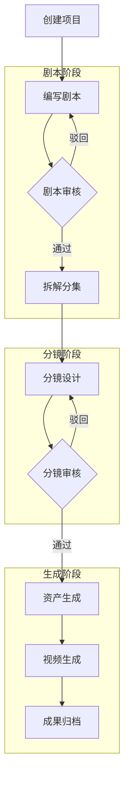
```mermaid
flowchart TD
    A[创建项目] --> B[编写剧本]
    B --> C{剧本审核}
    C -->|通过| D[拆解分集]
    C -->|驳回| B
    D --> E[分镜设计]
    E --> F{分镜审核}
    F -->|通过| G[资产生成]
    F -->|驳回| E
    G --> H[视频生成]
    H --> I[成果归档]

    subgraph script_stage["剧本阶段"]
        B
        C
        D
    end

    subgraph storyboard_stage["分镜阶段"]
        E
        F
    end

    subgraph gen_stage["生成阶段"]
        G
        H
        I
    end
```

---

## 2. 数据流转架构

API层、Store层、Page层之间的标准数据加载模式。

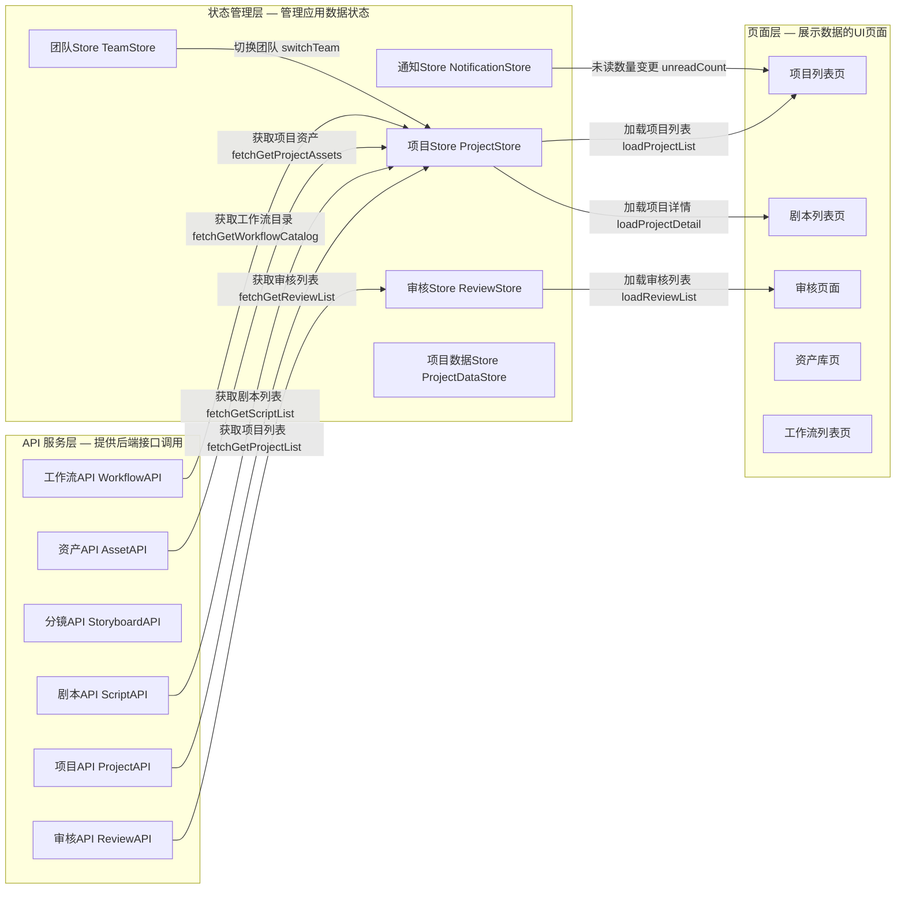
```mermaid
flowchart LR
    subgraph api_layer["API 服务层 — 提供后端接口调用"]
        ProjectAPI["项目API ProjectAPI"]
        ScriptAPI["剧本API ScriptAPI"]
        StoryboardAPI["分镜API StoryboardAPI"]
        ReviewAPI["审核API ReviewAPI"]
        AssetAPI["资产API AssetAPI"]
        WorkflowAPI["工作流API WorkflowAPI"]
    end

    subgraph store_layer["状态管理层 — 管理应用数据状态"]
        ProjectStore["项目Store ProjectStore"]
        ReviewStore["审核Store ReviewStore"]
        TeamStore["团队Store TeamStore"]
        NotificationStore["通知Store NotificationStore"]
        ProjectDataStore["项目数据Store ProjectDataStore"]
    end

    subgraph page_layer["页面层 — 展示数据的UI页面"]
        ProjectList[项目列表页]
        ScriptList[剧本列表页]
        ReviewPage[审核页面]
        AssetLibrary[资产库页]
        WorkflowList[工作流列表页]
    end

    ProjectAPI -->|"获取项目列表 fetchGetProjectList"| ProjectStore
    ScriptAPI -->|"获取剧本列表 fetchGetScriptList"| ProjectStore
    ReviewAPI -->|"获取审核列表 fetchGetReviewList"| ReviewStore
    AssetAPI -->|"获取项目资产 fetchGetProjectAssets"| ProjectStore
    WorkflowAPI -->|"获取工作流目录 fetchGetWorkflowCatalog"| ProjectStore

    ProjectStore -->|"加载项目列表 loadProjectList"| ProjectList
    ProjectStore -->|"加载项目详情 loadProjectDetail"| ScriptList
    ReviewStore -->|"加载审核列表 loadReviewList"| ReviewPage
    TeamStore -->|"切换团队 switchTeam"| ProjectStore
    NotificationStore -->|"未读数量变更 unreadCount"| ProjectList
```

---

## 3. 审核工作流

剧本审核与分镜审核的统一流程，共享 ReviewAPI 和 ReviewStore。

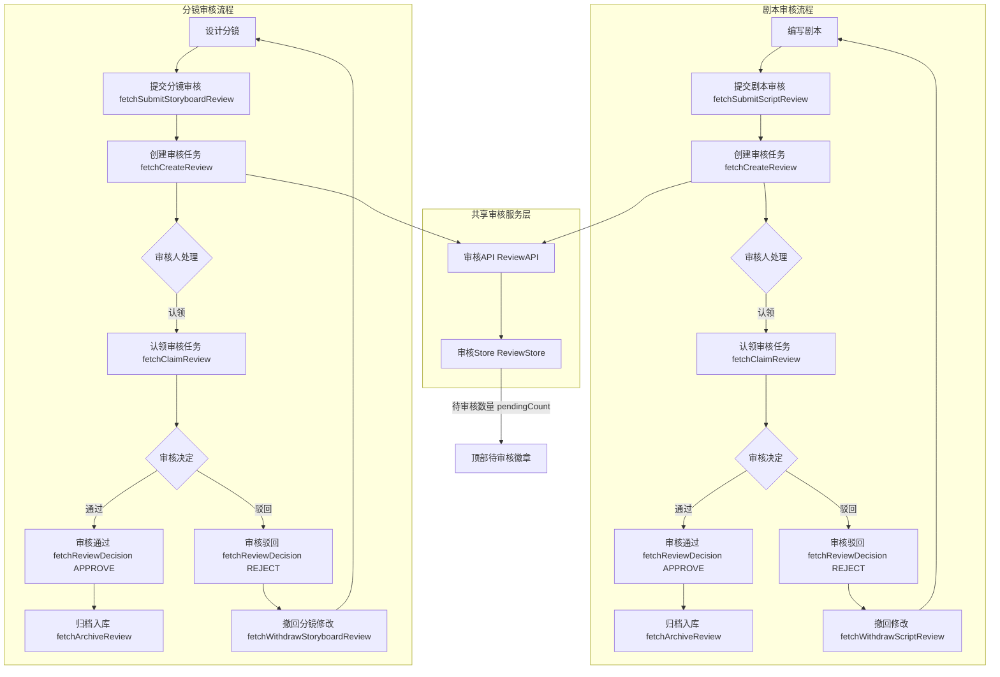
```mermaid
flowchart TD
    subgraph script_review["剧本审核流程"]
        S1[编写剧本] --> S2["提交剧本审核 fetchSubmitScriptReview"]
        S2 --> S3["创建审核任务 fetchCreateReview"]
        S3 --> S4{审核人处理}
        S4 -->|认领| S5["认领审核任务 fetchClaimReview"]
        S5 --> S6{审核决定}
        S6 -->|通过| S7["审核通过 fetchReviewDecision APPROVE"]
        S6 -->|驳回| S8["审核驳回 fetchReviewDecision REJECT"]
        S7 --> S9["归档入库 fetchArchiveReview"]
        S8 --> S10["撤回修改 fetchWithdrawScriptReview"]
        S10 --> S1
    end

    subgraph storyboard_review["分镜审核流程"]
        B1[设计分镜] --> B2["提交分镜审核 fetchSubmitStoryboardReview"]
        B2 --> B3["创建审核任务 fetchCreateReview"]
        B3 --> B4{审核人处理}
        B4 -->|认领| B5["认领审核任务 fetchClaimReview"]
        B5 --> B6{审核决定}
        B6 -->|通过| B7["审核通过 fetchReviewDecision APPROVE"]
        B6 -->|驳回| B8["审核驳回 fetchReviewDecision REJECT"]
        B7 --> B9["归档入库 fetchArchiveReview"]
        B8 --> B10["撤回分镜修改 fetchWithdrawStoryboardReview"]
        B10 --> B1
    end

    subgraph shared_review["共享审核服务层"]
        ReviewAPI["审核API ReviewAPI"]
        ReviewStore["审核Store ReviewStore"]
    end

    S3 --> ReviewAPI
    B3 --> ReviewAPI
    ReviewAPI --> ReviewStore
    ReviewStore -->|"待审核数量 pendingCount"| HeaderBadge[顶部待审核徽章]
```

---

## 4. AI 工作流执行

工作流的阻塞模式与 SSE 流式模式执行过程。

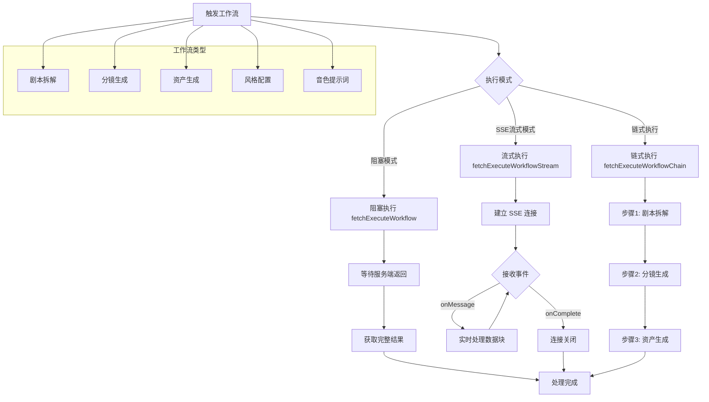
```mermaid
flowchart TD
    Start[触发工作流] --> Mode{执行模式}

    Mode -->|阻塞模式| Block["阻塞执行 fetchExecuteWorkflow"]
    Block --> BlockWait[等待服务端返回]
    BlockWait --> BlockResult[获取完整结果]
    BlockResult --> End[处理完成]

    Mode -->|SSE流式模式| SSE["流式执行 fetchExecuteWorkflowStream"]
    SSE --> SSEConnect[建立 SSE 连接]
    SSEConnect --> SSEEvent{接收事件}
    SSEEvent -->|onMessage| SSEProcess[实时处理数据块]
    SSEProcess --> SSEEvent
    SSEEvent -->|onComplete| SSEClose[连接关闭]
    SSEClose --> End

    Mode -->|链式执行| Chain["链式执行 fetchExecuteWorkflowChain"]
    Chain --> ChainStep1[步骤1: 剧本拆解]
    ChainStep1 --> ChainStep2[步骤2: 分镜生成]
    ChainStep2 --> ChainStep3[步骤3: 资产生成]
    ChainStep3 --> End

    subgraph workflow_types["工作流类型"]
        Decompose[剧本拆解]
        Storyboard[分镜生成]
        AssetGen[资产生成]
        StyleConfig[风格配置]
        VoicePrompt[音色提示词]
    end

    Start --> Decompose
    Start --> Storyboard
    Start --> AssetGen
    Start --> StyleConfig
    Start --> VoicePrompt
```

---

## 5. ProjectStore vs ProjectDataStore 数据交换

两个项目 Store 的职责划分与数据流动。

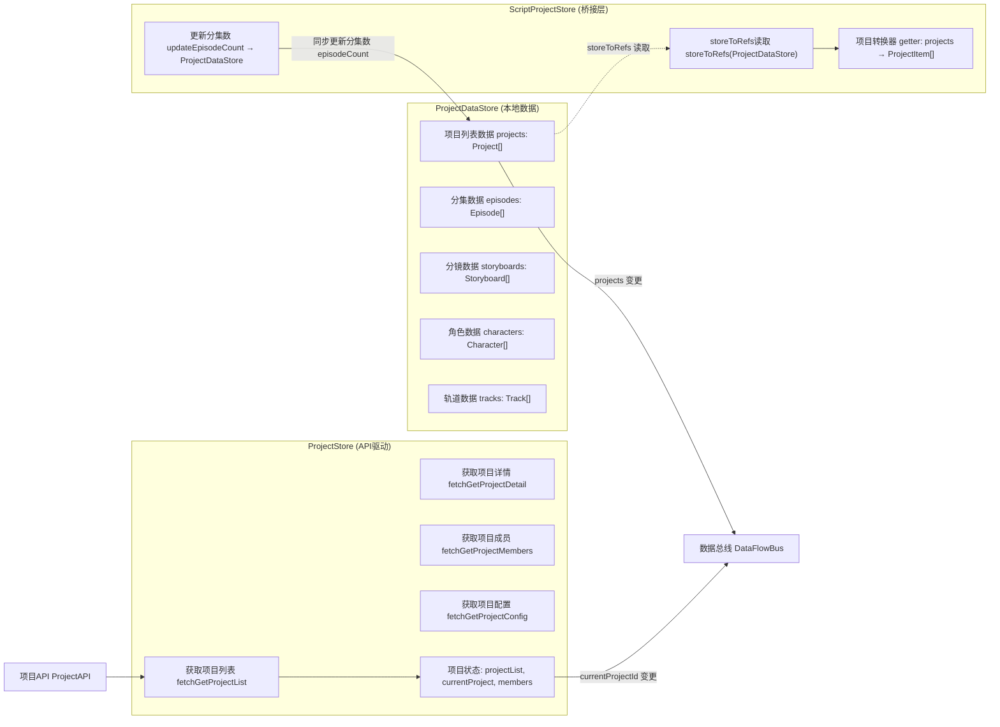
```mermaid
flowchart LR
    subgraph ProjectStore["ProjectStore (API驱动)"]
        PS_API["获取项目列表 fetchGetProjectList"]
        PS_Detail["获取项目详情 fetchGetProjectDetail"]
        PS_Members["获取项目成员 fetchGetProjectMembers"]
        PS_Config["获取项目配置 fetchGetProjectConfig"]
        PS_State["项目状态: projectList, currentProject, members"]
    end

    subgraph ProjectDataStore["ProjectDataStore (本地数据)"]
        PD_Projects["项目列表数据 projects: Project[]"]
        PD_Episodes["分集数据 episodes: Episode[]"]
        PD_Storyboards["分镜数据 storyboards: Storyboard[]"]
        PD_Characters["角色数据 characters: Character[]"]
        PD_Tracks["轨道数据 tracks: Track[]"]
    end

    subgraph ScriptProjectStore["ScriptProjectStore (桥接层)"]
        SP_Refs["storeToRefs读取 storeToRefs(ProjectDataStore)"]
        SP_Getter["项目转换器 getter: projects → ProjectItem[]"]
        SP_Update["更新分集数 updateEpisodeCount → ProjectDataStore"]
    end

    ProjectAPI["项目API ProjectAPI"] --> PS_API
    PS_API --> PS_State

    PD_Projects -.->|"storeToRefs 读取"| SP_Refs
    SP_Refs --> SP_Getter
    SP_Update -->|"同步更新分集数 episodeCount"| PD_Projects

    PS_State -->|"currentProjectId 变更"| DataFlowBus["数据总线 DataFlowBus"]
    PD_Projects -->|"projects 变更"| DataFlowBus
```

---

## 6. 项目成员与团队成员同步

团队切换触发项目成员重新加载的联动机制。

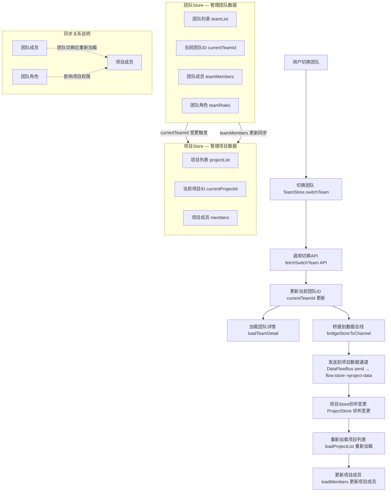
```mermaid
flowchart TD
    SwitchTeam[用户切换团队] --> TeamStore_switchTeam["切换团队 TeamStore.switchTeam"]
    TeamStore_switchTeam --> FetchSwitchTeam["调用切换API fetchSwitchTeam API"]
    FetchSwitchTeam --> UpdateTeamId["更新当前团队ID currentTeamId 更新"]
    UpdateTeamId --> LoadTeamDetail["加载团队详情 loadTeamDetail"]
    UpdateTeamId --> BridgeTeamToBus["桥接到数据总线 bridgeStoreToChannel"]
    BridgeTeamToBus --> DataFlowBusSend["发送到项目数据通道 DataFlowBus.send → flow:store->project-data"]

    DataFlowBusSend --> ProjectStoreReload["项目Store侦听变更 ProjectStore 侦听变更"]
    ProjectStoreReload --> LoadProjectList["重新加载项目列表 loadProjectList 重新加载"]
    LoadProjectList --> LoadMembers["更新项目成员 loadMembers 更新项目成员"]

    subgraph TeamStore["团队Store — 管理团队数据"]
        tl["团队列表 teamList"]
        ctid["当前团队ID currentTeamId"]
        tm["团队成员 teamMembers"]
        tr["团队角色 teamRoles"]
    end

    subgraph ProjectStore["项目Store — 管理项目数据"]
        pl["项目列表 projectList"]
        cpid["当前项目ID currentProjectId"]
        pm["项目成员 members"]
    end

    TeamStore -->|"currentTeamId 变更触发"| ProjectStore
    TeamStore -->|"teamMembers 更新同步"| ProjectStore

    subgraph sync_relation["同步关系说明"]
        direction LR
        TeamMembers[团队成员] -.->|团队切换后重新加载| ProjectMembers[项目成员]
        TeamRoles[团队角色] -.->|影响项目权限| ProjectMembers
    end
```

---

## 7. 资产导入机制

项目资产与团队资产之间的导入关系。

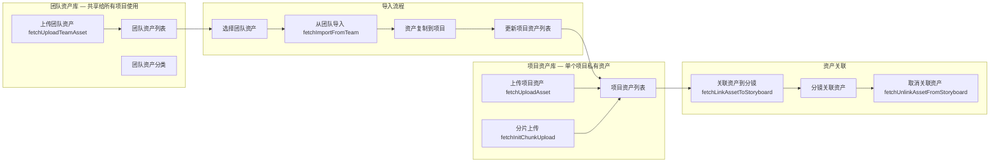
```mermaid
flowchart LR
    subgraph TeamAssetLib["团队资产库 — 共享给所有项目使用"]
        TA_List[团队资产列表]
        TA_Upload[上传团队资产 fetchUploadTeamAsset]
        TA_Categories[团队资产分类]
    end

    subgraph ProjectAssetLib["项目资产库 — 单个项目私有资产"]
        PA_List[项目资产列表]
        PA_Upload[上传项目资产 fetchUploadAsset]
        PA_Chunk[分片上传 fetchInitChunkUpload]
    end

    subgraph ImportFlow["导入流程"]
        Select[选择团队资产]
        Import["从团队导入 fetchImportFromTeam"]
        Copy[资产复制到项目]
        Update[更新项目资产列表]
    end

    TA_List --> Select
    Select --> Import
    Import --> Copy
    Copy --> Update
    Update --> PA_List

    TA_Upload --> TA_List
    PA_Upload --> PA_List
    PA_Chunk --> PA_List

    subgraph asset_link["资产关联"]
        LinkAsset["关联资产到分镜 fetchLinkAssetToStoryboard"]
        UnlinkAsset["取消关联资产 fetchUnlinkAssetFromStoryboard"]
        StoryboardAssets[分镜关联资产]
    end

    PA_List --> LinkAsset
    LinkAsset --> StoryboardAssets
    StoryboardAssets --> UnlinkAsset
```

---

## 8. 积分同步机制

个人、项目、团队三级积分的同步关系。

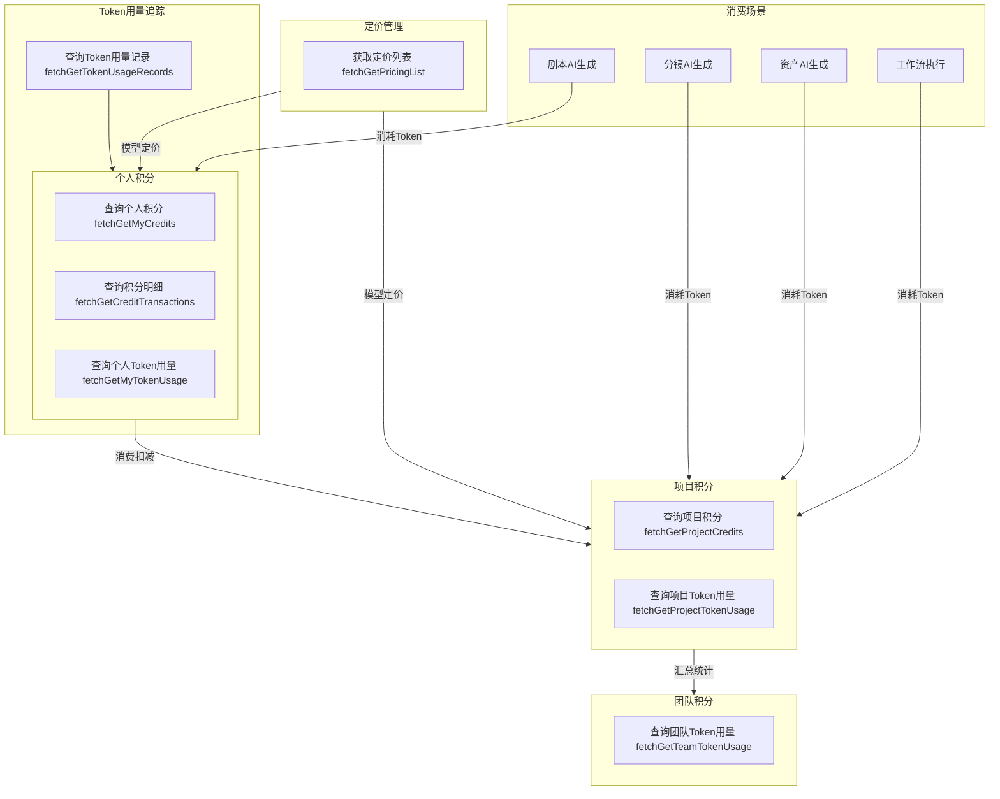
```mermaid
flowchart TD
    subgraph Personal["个人积分"]
        MyCredits["查询个人积分 fetchGetMyCredits"]
        MyTransactions["查询积分明细 fetchGetCreditTransactions"]
        MyTokenUsage["查询个人Token用量 fetchGetMyTokenUsage"]
    end

    subgraph Project["项目积分"]
        ProjectCredits["查询项目积分 fetchGetProjectCredits"]
        ProjectTokenUsage["查询项目Token用量 fetchGetProjectTokenUsage"]
    end

    subgraph Team["团队积分"]
        TeamTokenUsage["查询团队Token用量 fetchGetTeamTokenUsage"]
    end

    subgraph Pricing["定价管理"]
        PricingList["获取定价列表 fetchGetPricingList"]
    end

    Personal -->|消费扣减| Project
    Project -->|汇总统计| Team
    Pricing -->|模型定价| Personal
    Pricing -->|模型定价| Project

    subgraph consumption["消费场景"]
        ScriptAI[剧本AI生成]
        StoryboardAI[分镜AI生成]
        AssetAI[资产AI生成]
        WorkflowExec[工作流执行]
    end

    ScriptAI -->|消耗Token| Personal
    StoryboardAI -->|消耗Token| Project
    AssetAI -->|消耗Token| Project
    WorkflowExec -->|消耗Token| Project

    subgraph token_usage["Token用量追踪"]
        TokenRecords["查询Token用量记录 fetchGetTokenUsageRecords"]
        TokenRecords --> Personal
    end
```

---

## 9. 登出级联清理

UserStore.logOut() 触发的级联清理流程。

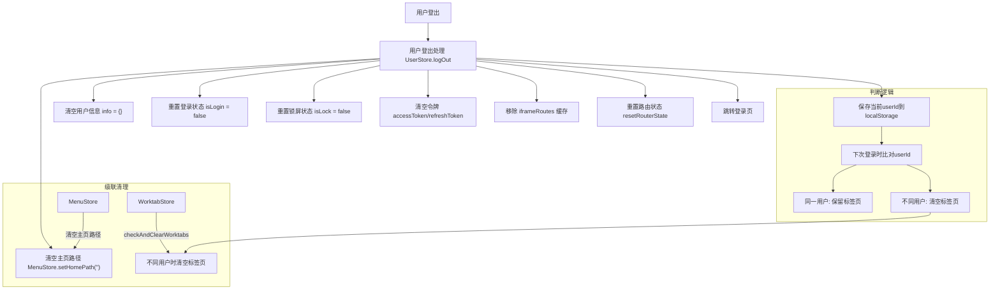
```mermaid
flowchart TD
    Logout[用户登出] --> UserStore_logOut["用户登出处理 UserStore.logOut"]

    UserStore_logOut --> ClearUserInfo["清空用户信息 info = {}"]
    UserStore_logOut --> ClearLoginStatus[重置登录状态 isLogin = false]
    UserStore_logOut --> ClearLock[重置锁屏状态 isLock = false]
    UserStore_logOut --> ClearTokens[清空令牌 accessToken/refreshToken]
    UserStore_logOut --> ClearSessionStorage[移除 iframeRoutes 缓存]

    UserStore_logOut --> MenuStore_Clear["清空主页路径 MenuStore.setHomePath('')"]
    UserStore_logOut --> ResetRouterState["重置路由状态 resetRouterState"]
    UserStore_logOut --> RedirectToLogin[跳转登录页]

    subgraph cascade_clean["级联清理"]
        direction LR
        MenuStore[MenuStore] -->|清空主页路径| MenuStore_Clear
        WorktabStore[WorktabStore] -->|checkAndClearWorktabs| ClearWorktabs[不同用户时清空标签页]
    end

    subgraph judge_logic["判断逻辑"]
        SaveUserId[保存当前userId到localStorage]
        NextLogin[下次登录时比对userId]
        SameUser[同一用户: 保留标签页]
        DiffUser[不同用户: 清空标签页]
    end

    UserStore_logOut --> SaveUserId
    SaveUserId --> NextLogin
    NextLogin --> SameUser
    NextLogin --> DiffUser
    DiffUser --> ClearWorktabs
```

---

## 10. Store 依赖关系图

各 Store 模块之间的依赖和数据流动关系。

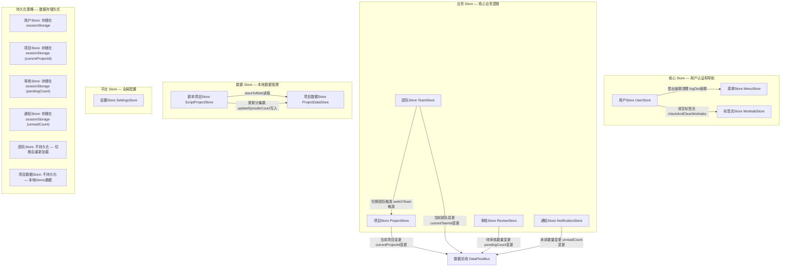
```mermaid
flowchart TD
    subgraph Core["核心 Store — 用户认证和导航"]
        UserStore["用户Store UserStore"]
        MenuStore["菜单Store MenuStore"]
        WorktabStore["标签页Store WorktabStore"]
    end

    subgraph Business["业务 Store — 核心业务逻辑"]
        ProjectStore["项目Store ProjectStore"]
        TeamStore["团队Store TeamStore"]
        ReviewStore["审核Store ReviewStore"]
        NotificationStore["通知Store NotificationStore"]
    end

    subgraph Data["数据 Store — 本地数据管理"]
        ProjectDataStore["项目数据Store ProjectDataStore"]
        ScriptProjectStore["剧本项目Store ScriptProjectStore"]
    end

    subgraph Platform["平台 Store — 全局配置"]
        SettingsStore["设置Store SettingsStore"]
    end

    UserStore -->|"登出级联清理 logOut级联"| MenuStore
    UserStore -->|"清空标签页 checkAndClearWorktabs"| WorktabStore
    TeamStore -->|"切换团队触发 switchTeam触发"| ProjectStore
    ScriptProjectStore -->|"storeToRefs读取"| ProjectDataStore
    ScriptProjectStore -->|"更新分集数 updateEpisodeCount写入"| ProjectDataStore
    ProjectStore -->|"当前项目变更 currentProjectId变更"| DataFlowBus["数据总线 DataFlowBus"]
    TeamStore -->|"当前团队变更 currentTeamId变更"| DataFlowBus
    ReviewStore -->|"待审核数量变更 pendingCount变更"| DataFlowBus
    NotificationStore -->|"未读数量变更 unreadCount变更"| DataFlowBus

    subgraph persist_strategy["持久化策略 — 数据存储方式"]
        UserPersist["用户Store: 存储在sessionStorage"]
        ProjectPersist["项目Store: 存储在sessionStorage (currentProjectId)"]
        ReviewPersist["审核Store: 存储在sessionStorage (pendingCount)"]
        NotificationPersist["通知Store: 存储在sessionStorage (unreadCount)"]
        TeamNoPersist["团队Store: 不持久化 — 切换后重新加载"]
        DataNoPersist["项目数据Store: 不持久化 — 本地Demo数据"]
    end
```

---

## 11. DataFlowBus 内置通道流

DataFlowBus 注册的所有内置通道及其数据流向。

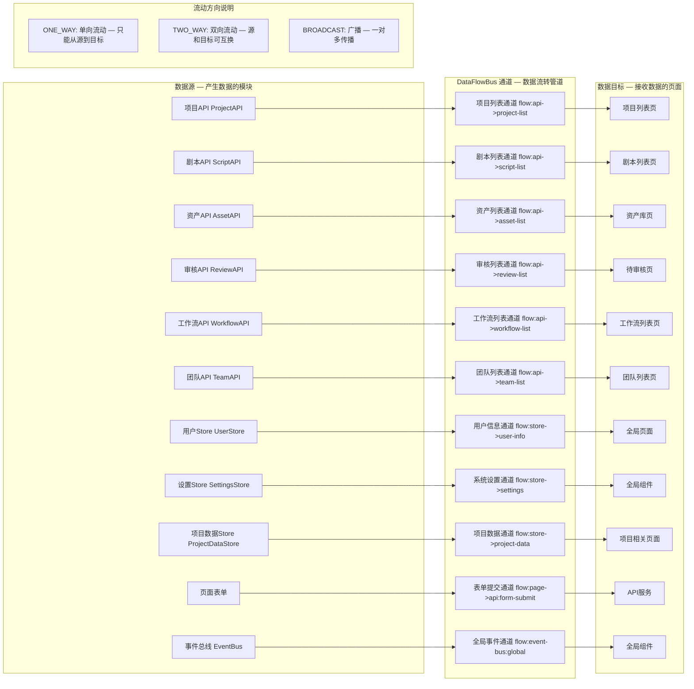
```mermaid
flowchart LR
    subgraph Sources["数据源 — 产生数据的模块"]
        ProjectAPI["项目API ProjectAPI"]
        ScriptAPI["剧本API ScriptAPI"]
        AssetAPI["资产API AssetAPI"]
        ReviewAPI["审核API ReviewAPI"]
        WorkflowAPI["工作流API WorkflowAPI"]
        TeamAPI["团队API TeamAPI"]
        UserStore["用户Store UserStore"]
        SettingsStore["设置Store SettingsStore"]
        ProjectDataStore["项目数据Store ProjectDataStore"]
        PageForm[页面表单]
        EventBus["事件总线 EventBus"]
    end

    subgraph Channels["DataFlowBus 通道 — 数据流转管道"]
        C1["项目列表通道 flow:api->project-list"]
        C2["剧本列表通道 flow:api->script-list"]
        C3["资产列表通道 flow:api->asset-list"]
        C4["审核列表通道 flow:api->review-list"]
        C5["工作流列表通道 flow:api->workflow-list"]
        C6["团队列表通道 flow:api->team-list"]
        C7["用户信息通道 flow:store->user-info"]
        C8["系统设置通道 flow:store->settings"]
        C9["项目数据通道 flow:store->project-data"]
        C10["表单提交通道 flow:page->api:form-submit"]
        C11["全局事件通道 flow:event-bus:global"]
    end

    subgraph Targets["数据目标 — 接收数据的页面"]
        ProjectListPage[项目列表页]
        ScriptListPage[剧本列表页]
        AssetLibPage[资产库页]
        ReviewPendingPage[待审核页]
        WorkflowListPage[工作流列表页]
        TeamListPage[团队列表页]
        AllPages[全局页面]
        AllComponents[全局组件]
        ProjectPages[项目相关页面]
        APIServices[API服务]
        GlobalComponents[全局组件]
    end

    ProjectAPI --> C1 --> ProjectListPage
    ScriptAPI --> C2 --> ScriptListPage
    AssetAPI --> C3 --> AssetLibPage
    ReviewAPI --> C4 --> ReviewPendingPage
    WorkflowAPI --> C5 --> WorkflowListPage
    TeamAPI --> C6 --> TeamListPage

    UserStore --> C7 --> AllPages
    SettingsStore --> C8 --> AllComponents
    ProjectDataStore --> C9 --> ProjectPages
    PageForm --> C10 --> APIServices
    EventBus --> C11 --> GlobalComponents

    subgraph direction_desc["流动方向说明"]
        direction TB
        ONEWAY["ONE_WAY: 单向流动 — 只能从源到目标"]
        TWOWAY["TWO_WAY: 双向流动 — 源和目标可互换"]
        BROADCAST["BROADCAST: 广播 — 一对多传播"]
    end
```

---

## 12. Store 到 DataFlowBus 桥接

Store 状态变更自动桥接到 DataFlowBus 通道的机制。

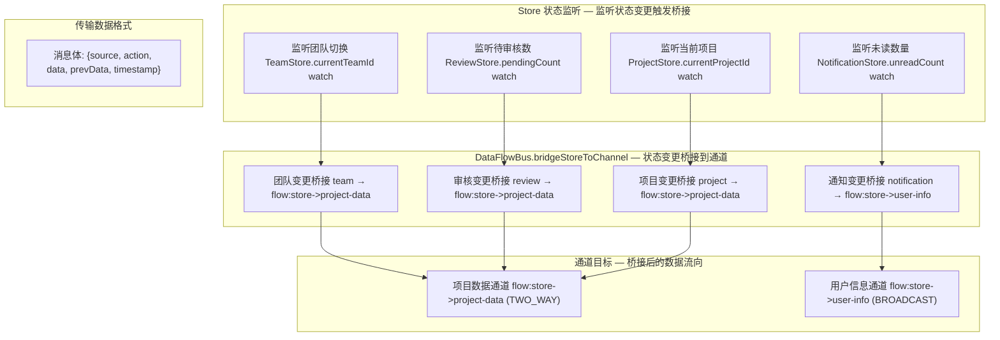
```mermaid
flowchart TD
    subgraph StoreWatchers["Store 状态监听 — 监听状态变更触发桥接"]
        TeamWatch["监听团队切换 TeamStore.currentTeamId watch"]
        NotificationWatch["监听未读数量 NotificationStore.unreadCount watch"]
        ReviewWatch["监听待审核数 ReviewStore.pendingCount watch"]
        ProjectWatch["监听当前项目 ProjectStore.currentProjectId watch"]
    end

    subgraph DataFlowBus["DataFlowBus.bridgeStoreToChannel — 状态变更桥接到通道"]
        TeamBridge["团队变更桥接 team → flow:store->project-data"]
        NotificationBridge["通知变更桥接 notification → flow:store->user-info"]
        ReviewBridge["审核变更桥接 review → flow:store->project-data"]
        ProjectBridge["项目变更桥接 project → flow:store->project-data"]
    end

    subgraph ChannelTargets["通道目标 — 桥接后的数据流向"]
        ProjectDataChannel["项目数据通道 flow:store->project-data (TWO_WAY)"]
        UserInfoChannel["用户信息通道 flow:store->user-info (BROADCAST)"]
    end

    TeamWatch --> TeamBridge
    NotificationWatch --> NotificationBridge
    ReviewWatch --> ReviewBridge
    ProjectWatch --> ProjectBridge

    TeamBridge --> ProjectDataChannel
    NotificationBridge --> UserInfoChannel
    ReviewBridge --> ProjectDataChannel
    ProjectBridge --> ProjectDataChannel

    subgraph data_format["传输数据格式"]
        direction LR
        Payload["消息体: {source, action, data, prevData, timestamp}"]
    end
```

---

## 模块内部子模块数据流

各核心模块内部子模块之间的数据流转关系。

### 13. 项目管理子模块数据流

展示项目管理模块内部 10 个子模块的交互。

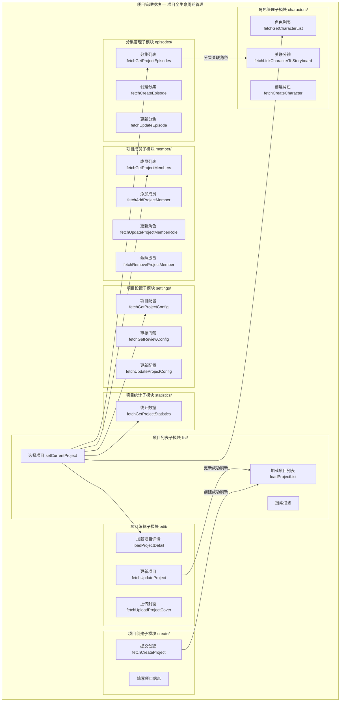
```mermaid
flowchart TD
    subgraph project_module["项目管理模块 — 项目全生命周期管理"]
        subgraph proj_list["项目列表子模块 list/"]
            PL_Load["加载项目列表 loadProjectList"]
            PL_Select["选择项目 setCurrentProject"]
            PL_Search["搜索过滤"]
        end

        subgraph proj_create["项目创建子模块 create/"]
            PC_Form["填写项目信息"]
            PC_Submit["提交创建 fetchCreateProject"]
        end

        subgraph proj_edit["项目编辑子模块 edit/"]
            PE_Load["加载项目详情 loadProjectDetail"]
            PE_Update["更新项目 fetchUpdateProject"]
            PE_Cover["上传封面 fetchUploadProjectCover"]
        end

        subgraph proj_member["项目成员子模块 member/"]
            PM_List["成员列表 fetchGetProjectMembers"]
            PM_Add["添加成员 fetchAddProjectMember"]
            PM_Role["更新角色 fetchUpdateProjectMemberRole"]
            PM_Remove["移除成员 fetchRemoveProjectMember"]
        end

        subgraph proj_settings["项目设置子模块 settings/"]
            PS_Config["项目配置 fetchGetProjectConfig"]
            PS_Review["审核门禁 fetchGetReviewConfig"]
            PS_Update["更新配置 fetchUpdateProjectConfig"]
        end

        subgraph proj_stats["项目统计子模块 statistics/"]
            PST_Data["统计数据 fetchGetProjectStatistics"]
        end

        subgraph proj_episodes["分集管理子模块 episodes/"]
            PE_List["分集列表 fetchGetProjectEpisodes"]
            PE_Create["创建分集 fetchCreateEpisode"]
            PE_UpdateE["更新分集 fetchUpdateEpisode"]
        end

        subgraph proj_characters["角色管理子模块 characters/"]
            PC_List["角色列表 fetchGetCharacterList"]
            PC_Create["创建角色 fetchCreateCharacter"]
            PC_Link["关联分镜 fetchLinkCharacterToStoryboard"]
        end
    end

    PL_Select --> PE_Load
    PL_Select --> PM_List
    PL_Select --> PS_Config
    PL_Select --> PST_Data
    PL_Select --> PE_List
    PL_Select --> PC_List

    PC_Submit -->|"创建成功刷新"| PL_Load
    PE_Update -->|"更新成功刷新"| PL_Load

    PE_List -->|"分集关联角色"| PC_Link
```

---

### 14. 剧本管理子模块数据流

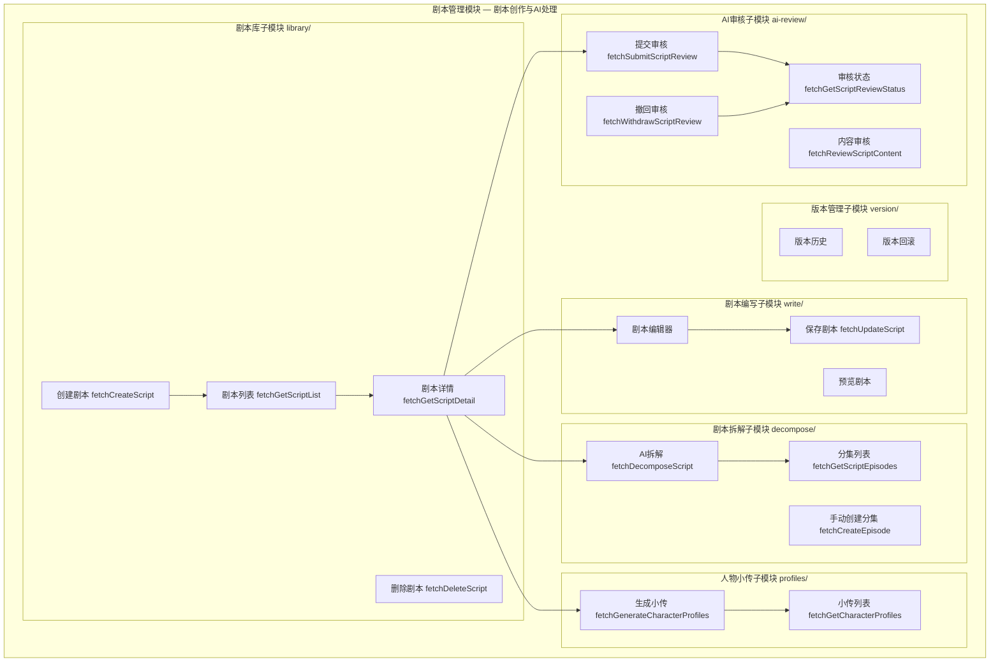
```mermaid
flowchart TD
    subgraph script_module["剧本管理模块 — 剧本创作与AI处理"]
        subgraph script_library["剧本库子模块 library/"]
            SL_List["剧本列表 fetchGetScriptList"]
            SL_Detail["剧本详情 fetchGetScriptDetail"]
            SL_Create["创建剧本 fetchCreateScript"]
            SL_Delete["删除剧本 fetchDeleteScript"]
        end

        subgraph script_write["剧本编写子模块 write/"]
            SW_Editor["剧本编辑器"]
            SW_Save["保存剧本 fetchUpdateScript"]
            SW_Preview["预览剧本"]
        end

        subgraph script_decompose["剧本拆解子模块 decompose/"]
            SD_Decompose["AI拆解 fetchDecomposeScript"]
            SD_Episodes["分集列表 fetchGetScriptEpisodes"]
            SD_Manual["手动创建分集 fetchCreateEpisode"]
        end

        subgraph script_profiles["人物小传子模块 profiles/"]
            SP_Generate["生成小传 fetchGenerateCharacterProfiles"]
            SP_List["小传列表 fetchGetCharacterProfiles"]
        end

        subgraph script_version["版本管理子模块 version/"]
            SV_History["版本历史"]
            SV_Rollback["版本回滚"]
        end

        subgraph script_ai_review["AI审核子模块 ai-review/"]
            SR_Submit["提交审核 fetchSubmitScriptReview"]
            SR_Withdraw["撤回审核 fetchWithdrawScriptReview"]
            SR_Status["审核状态 fetchGetScriptReviewStatus"]
            SR_Content["内容审核 fetchReviewScriptContent"]
        end
    end

    SL_List --> SL_Detail
    SL_Detail --> SW_Editor
    SW_Editor --> SW_Save
    SL_Create --> SL_List

    SL_Detail --> SD_Decompose
    SD_Decompose --> SD_Episodes

    SL_Detail --> SP_Generate
    SP_Generate --> SP_List

    SL_Detail --> SR_Submit
    SR_Submit --> SR_Status
    SR_Withdraw --> SR_Status
```

---

### 15. 审核系统子模块数据流

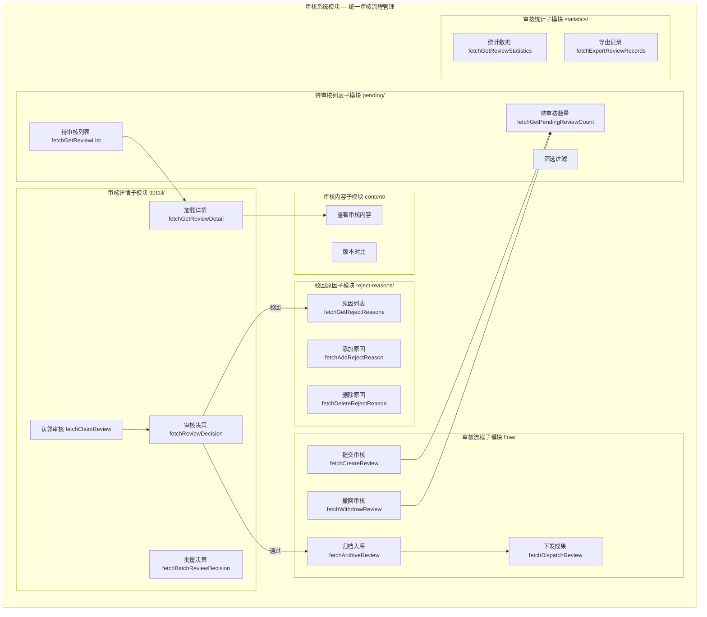
```mermaid
flowchart TD
    subgraph review_module["审核系统模块 — 统一审核流程管理"]
        subgraph review_pending["待审核列表子模块 pending/"]
            RP_List["待审核列表 fetchGetReviewList"]
            RP_Count["待审核数量 fetchGetPendingReviewCount"]
            RP_Filter["筛选过滤"]
        end

        subgraph review_detail["审核详情子模块 detail/"]
            RD_Load["加载详情 fetchGetReviewDetail"]
            RD_Claim["认领审核 fetchClaimReview"]
            RD_Decide["审核决策 fetchReviewDecision"]
            RD_Batch["批量决策 fetchBatchReviewDecision"]
        end

        subgraph review_content["审核内容子模块 content/"]
            RC_View["查看审核内容"]
            RC_Compare["版本对比"]
        end

        subgraph review_flow["审核流程子模块 flow/"]
            RF_Submit["提交审核 fetchCreateReview"]
            RF_Withdraw["撤回审核 fetchWithdrawReview"]
            RF_Archive["归档入库 fetchArchiveReview"]
            RF_Dispatch["下发成果 fetchDispatchReview"]
        end

        subgraph review_reject["驳回原因子模块 reject-reasons/"]
            RR_List["原因列表 fetchGetRejectReasons"]
            RR_Add["添加原因 fetchAddRejectReason"]
            RR_Delete["删除原因 fetchDeleteRejectReason"]
        end

        subgraph review_stats["审核统计子模块 statistics/"]
            RS_Data["统计数据 fetchGetReviewStatistics"]
            RS_Export["导出记录 fetchExportReviewRecords"]
        end
    end

    RP_List --> RD_Load
    RD_Load --> RC_View
    RD_Claim --> RD_Decide
    RD_Decide -->|"通过"| RF_Archive
    RD_Decide -->|"驳回"| RR_List
    RF_Archive --> RF_Dispatch
    RF_Submit --> RP_Count
    RF_Withdraw --> RP_Count
```

---

### 16. 资产管理子模块数据流

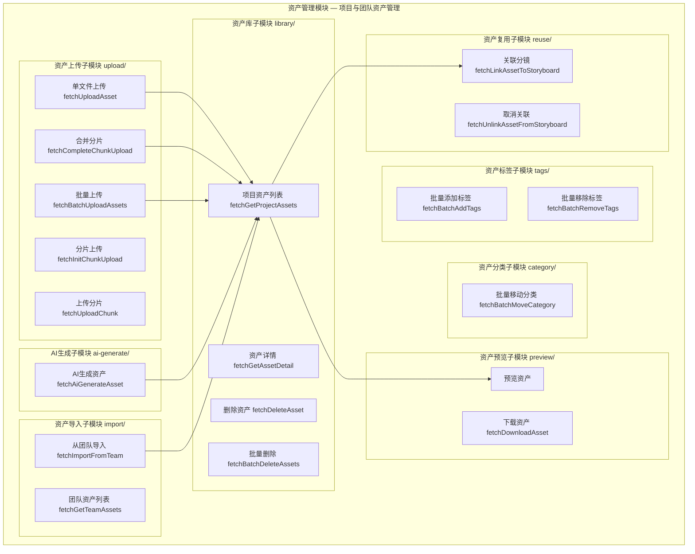
```mermaid
flowchart TD
    subgraph asset_module["资产管理模块 — 项目与团队资产管理"]
        subgraph asset_library["资产库子模块 library/"]
            AL_List["项目资产列表 fetchGetProjectAssets"]
            AL_Detail["资产详情 fetchGetAssetDetail"]
            AL_Delete["删除资产 fetchDeleteAsset"]
            AL_BatchDelete["批量删除 fetchBatchDeleteAssets"]
        end

        subgraph asset_upload["资产上传子模块 upload/"]
            AU_Single["单文件上传 fetchUploadAsset"]
            AU_Chunk["分片上传 fetchInitChunkUpload"]
            AU_ChunkUpload["上传分片 fetchUploadChunk"]
            AU_Complete["合并分片 fetchCompleteChunkUpload"]
            AU_Batch["批量上传 fetchBatchUploadAssets"]
        end

        subgraph asset_category["资产分类子模块 category/"]
            AC_Move["批量移动分类 fetchBatchMoveCategory"]
        end

        subgraph asset_tags["资产标签子模块 tags/"]
            AT_Add["批量添加标签 fetchBatchAddTags"]
            AT_Remove["批量移除标签 fetchBatchRemoveTags"]
        end

        subgraph asset_import["资产导入子模块 import/"]
            AI_Team["团队资产列表 fetchGetTeamAssets"]
            AI_Import["从团队导入 fetchImportFromTeam"]
        end

        subgraph asset_ai["AI生成子模块 ai-generate/"]
            AIG_Generate["AI生成资产 fetchAiGenerateAsset"]
        end

        subgraph asset_preview["资产预览子模块 preview/"]
            AP_View["预览资产"]
            AP_Download["下载资产 fetchDownloadAsset"]
        end

        subgraph asset_reuse["资产复用子模块 reuse/"]
            AR_Link["关联分镜 fetchLinkAssetToStoryboard"]
            AR_Unlink["取消关联 fetchUnlinkAssetFromStoryboard"]
        end
    end

    AU_Single --> AL_List
    AU_Complete --> AL_List
    AU_Batch --> AL_List
    AIG_Generate --> AL_List

    AI_Import --> AL_List
    AL_List --> AR_Link
    AL_List --> AP_View
```

---

### 17. 工作流引擎子模块数据流

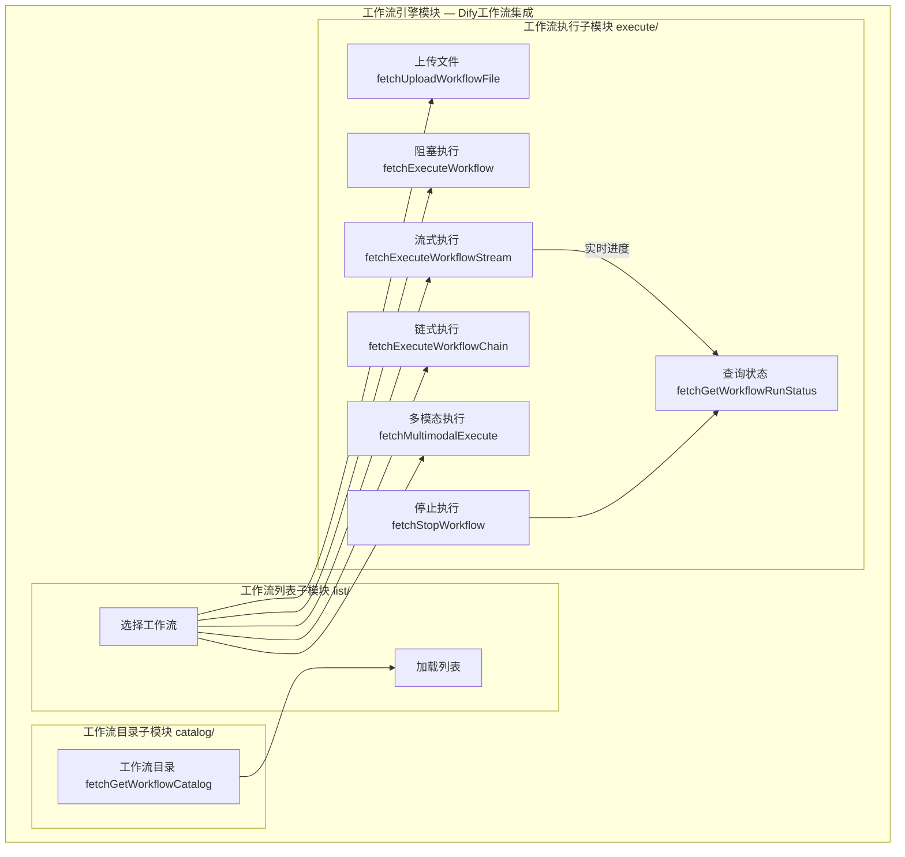
```mermaid
flowchart TD
    subgraph workflow_module["工作流引擎模块 — Dify工作流集成"]
        subgraph wf_catalog["工作流目录子模块 catalog/"]
            WC_List["工作流目录 fetchGetWorkflowCatalog"]
        end

        subgraph wf_list["工作流列表子模块 list/"]
            WL_Load["加载列表"]
            WL_Select["选择工作流"]
        end

        subgraph wf_execute["工作流执行子模块 execute/"]
            WE_Upload["上传文件 fetchUploadWorkflowFile"]
            WE_Block["阻塞执行 fetchExecuteWorkflow"]
            WE_Stream["流式执行 fetchExecuteWorkflowStream"]
            WE_Chain["链式执行 fetchExecuteWorkflowChain"]
            WE_Stop["停止执行 fetchStopWorkflow"]
            WE_Status["查询状态 fetchGetWorkflowRunStatus"]
            WE_Multi["多模态执行 fetchMultimodalExecute"]
        end
    end

    WC_List --> WL_Load
    WL_Select --> WE_Upload
    WL_Select --> WE_Block
    WL_Select --> WE_Stream
    WL_Select --> WE_Chain
    WL_Select --> WE_Multi

    WE_Stream -->|"实时进度"| WE_Status
    WE_Stop --> WE_Status
```

---

### 18. 积分系统子模块数据流

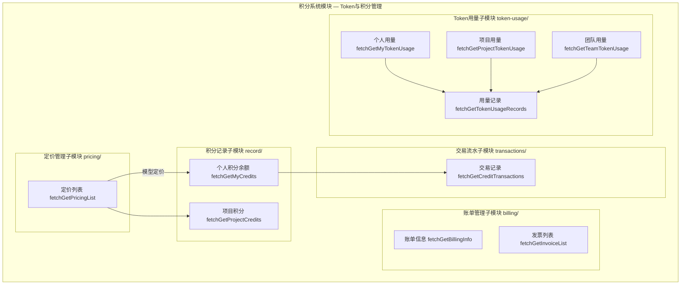
```mermaid
flowchart TD
    subgraph points_module["积分系统模块 — Token与积分管理"]
        subgraph points_record["积分记录子模块 record/"]
            PR_Balance["个人积分余额 fetchGetMyCredits"]
            PR_Project["项目积分 fetchGetProjectCredits"]
        end

        subgraph points_transactions["交易流水子模块 transactions/"]
            PT_List["交易记录 fetchGetCreditTransactions"]
        end

        subgraph points_pricing["定价管理子模块 pricing/"]
            PP_List["定价列表 fetchGetPricingList"]
        end

        subgraph points_billing["账单管理子模块 billing/"]
            PB_Info["账单信息 fetchGetBillingInfo"]
            PB_Invoice["发票列表 fetchGetInvoiceList"]
        end

        subgraph points_token["Token用量子模块 token-usage/"]
            PT_My["个人用量 fetchGetMyTokenUsage"]
            PT_Project["项目用量 fetchGetProjectTokenUsage"]
            PT_Team["团队用量 fetchGetTeamTokenUsage"]
            PT_Records["用量记录 fetchGetTokenUsageRecords"]
        end
    end

    PR_Balance --> PT_List
    PP_List -->|"模型定价"| PR_Balance
    PP_List --> PR_Project

    PT_My --> PT_Records
    PT_Project --> PT_Records
    PT_Team --> PT_Records
```

---

## 附录: 模块索引

| 模块 | 文件路径 | 职责 |
|------|----------|------|
| ProjectStore | `src/store/modules/project.ts` | 项目列表、详情、成员管理 |
| TeamStore | `src/store/modules/team.ts` | 团队切换、成员、角色管理 |
| ReviewStore | `src/store/modules/review.ts` | 审核列表、待审核数量 |
| ProjectDataStore | `src/store/modules/project-data.ts` | 本地项目数据（Demo） |
| ScriptProjectStore | `src/store/modules/script-project.ts` | 桥接 ProjectDataStore |
| UserStore | `src/store/modules/user.ts` | 用户认证、登出级联 |
| NotificationStore | `src/store/modules/notification.ts` | 通知、未读数量 |
| ProjectAPI | `src/api/project.ts` | 项目 CRUD、成员、配置 |
| ScriptAPI | `src/api/script.ts` | 剧本 CRUD、审核、AI生成 |
| StoryboardAPI | `src/api/storyboard.ts` | 分镜 CRUD、审核、版本 |
| ReviewAPI | `src/api/review.ts` | 统一审核服务 |
| AssetAPI | `src/api/asset.ts` | 资产管理、团队导入 |
| PointsAPI | `src/api/points.ts` | 积分、Token用量 |
| WorkflowAPI | `src/api/workflow.ts` | 工作流执行、SSE流式 |
| DataFlowBus | `src/utils/data-flow/bus.ts` | 统一数据流转平台 |
