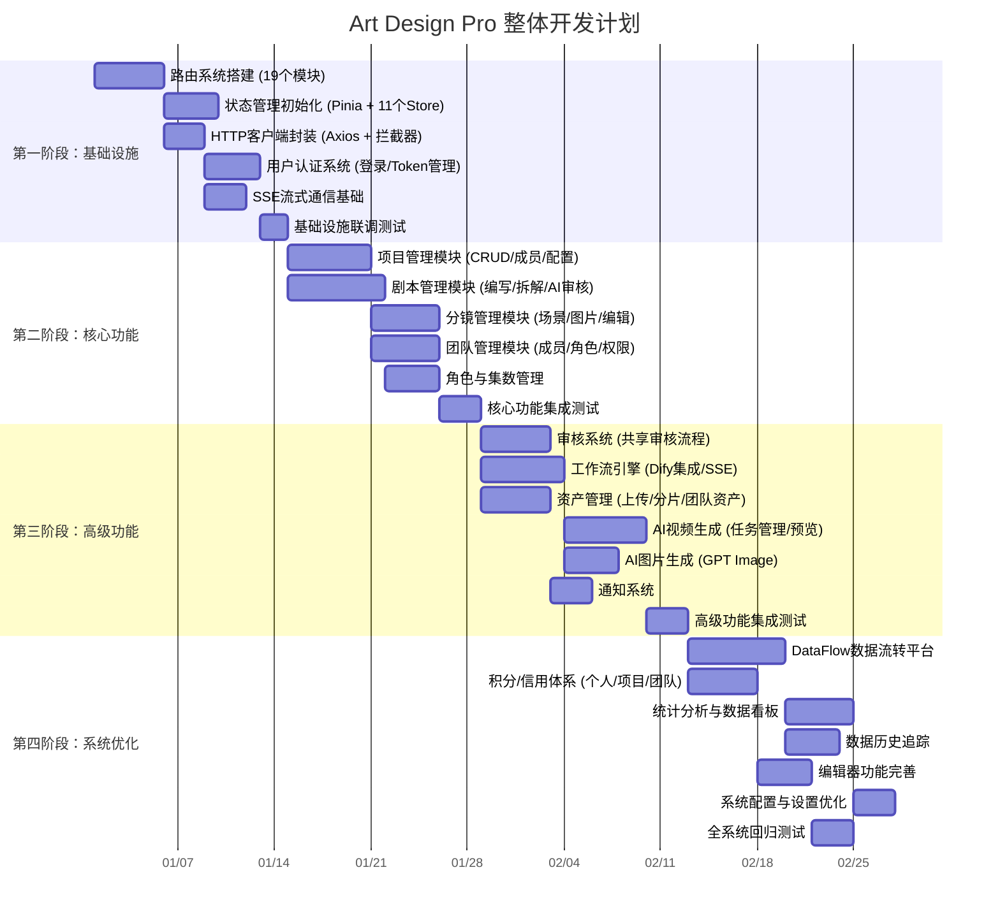
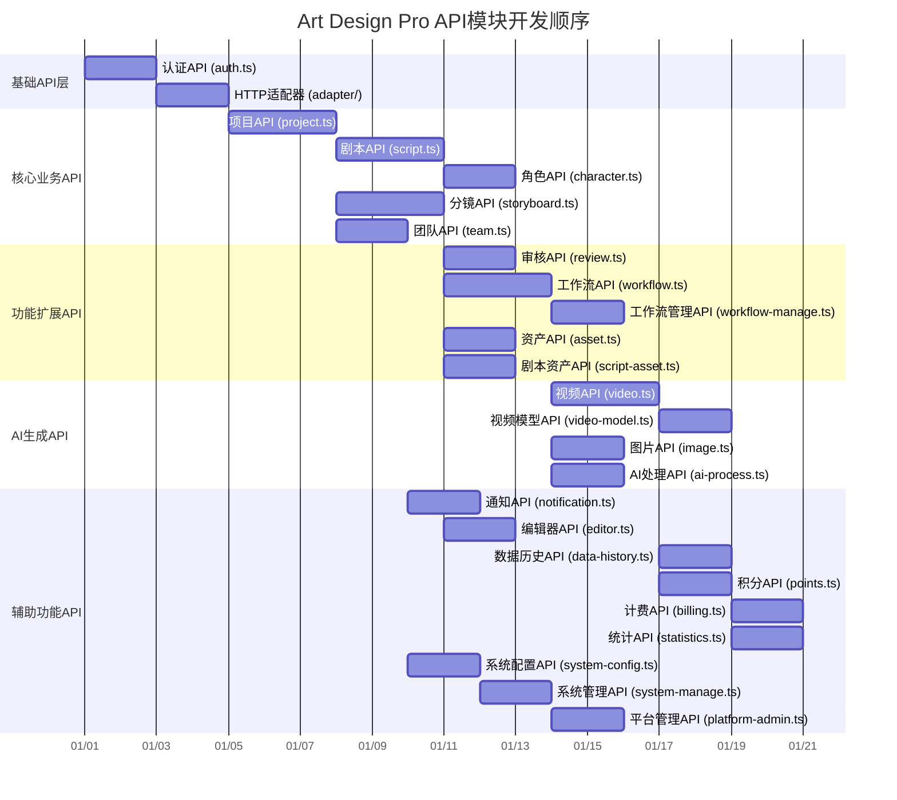
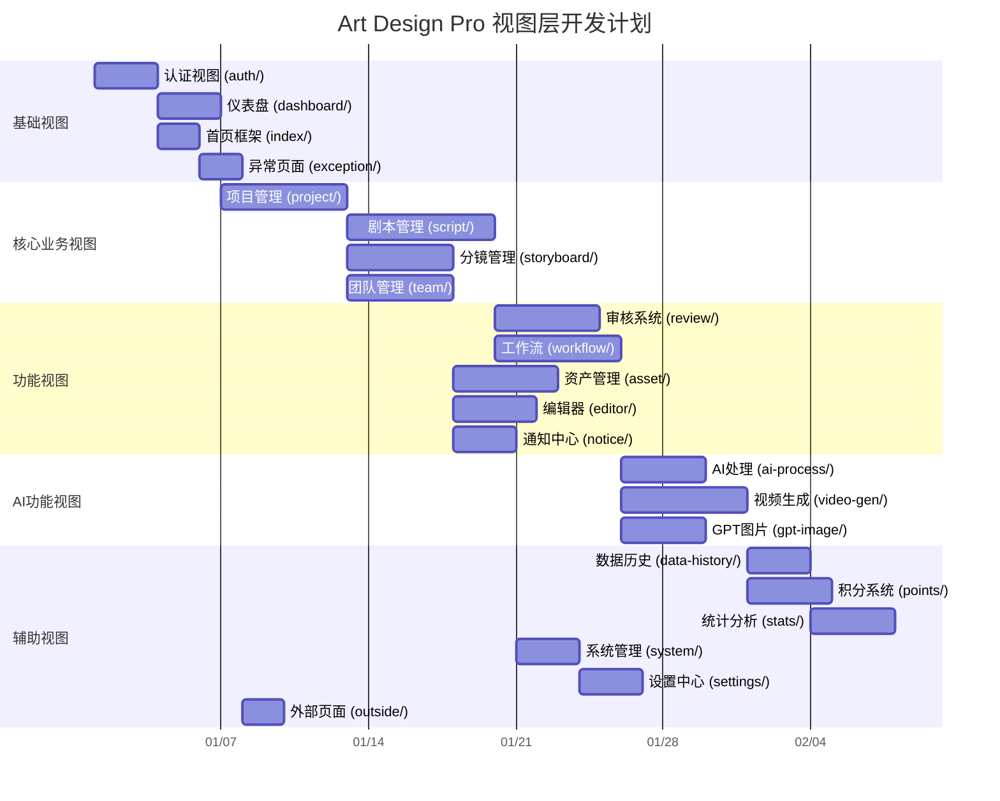
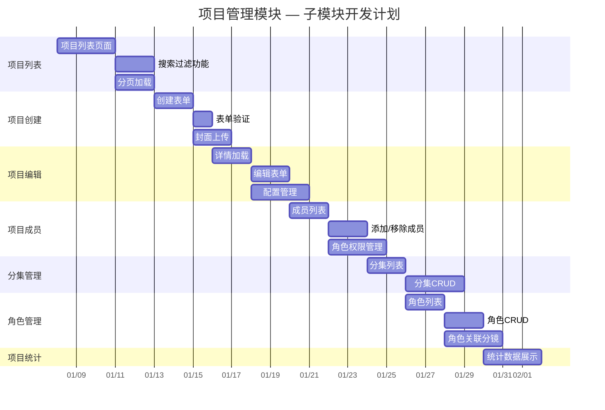
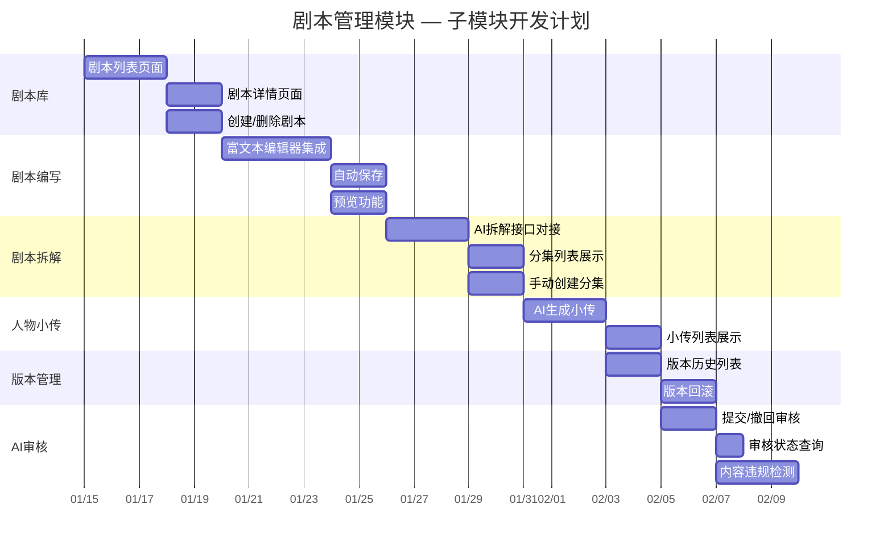
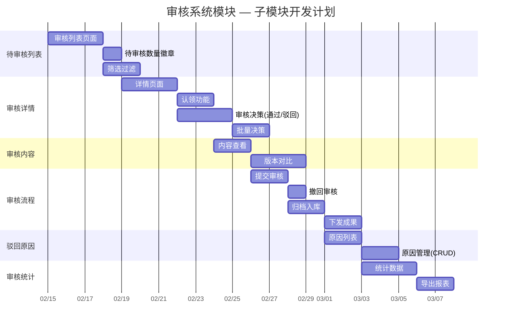

# Art Design Pro 项目开发甘特图

> 本文档使用 Mermaid 语法绘制项目开发进度甘特图，涵盖整体开发阶段、模块级开发计划和关键路径分析。

---

## 1. 整体项目开发甘特图

项目按四个阶段推进：基础设施搭建 → 核心功能开发 → 高级功能实现 → 系统优化完善。



---

## 2. 模块级开发甘特图

按11个主要功能模块维度展示各模块的开发周期和依赖关系。

```mermaid
gantt
    title Art Design Pro 模块级开发计划
    dateFormat  YYYY-MM-DD
    axisFormat  %m/%d

    section 路由模块 (19个)
    静态路由配置                       :r1, 2024-01-01, 2d
    动态路由加载                       :r2, after r1, 3d
    路由守卫与权限控制                 :r3, after r2, 2d
    路由模块单元测试                   :r4, after r3, 1d, done

    section 状态管理 (11个Store)
    用户状态 (user.ts)                :s1, after r4, 2d
    菜单状态 (menu.ts)                :s2, after s1, 1d, done
    项目状态 (project.ts)             :s3, after s1, 2d
    剧本状态 (script-project.ts)      :s4, after s3, 2d
    团队状态 (team.ts)                :s5, after s3, 1d, done
    审核状态 (review.ts)              :s6, after s4, 1d, done
    通知状态 (notification.ts)        :s7, after s5, 1d, done
    设置状态 (setting.ts)             :s8, after s6, 1d, done
    数据状态 (project-data.ts)        :s9, after s7, 1d, done
    工作标签 (worktab.ts)             :s10, after s8, 1d, done
    表格状态 (table.ts)               :s11, after s9, 1d, done

    section 项目管理
    项目列表与搜索                     :p1, after s3, 3d
    项目编辑与配置                     :p2, after p1, 3d
    项目成员管理                       :p3, after p2, 2d
    项目统计报表                       :p4, after p3, 2d

    section 剧本管理
    剧本库管理                         :sc1, after s4, 3d
    剧本编写器                         :sc2, after sc1, 4d
    剧本拆解功能                       :sc3, after sc2, 3d
    人物小传管理                       :sc4, after sc3, 2d
    AI审核结果展示                     :sc5, after sc4, 2d
    版本管理                           :sc6, after sc5, 2d

    section 分镜管理
    分镜列表                           :sb1, after p1, 2d
    分镜编辑器                         :sb2, after sb1, 4d
    场景管理                           :sb3, after sb2, 3d
    分镜图片管理                       :sb4, after sb3, 2d

    section 团队管理
    团队列表                           :t1, after s5, 2d
    团队成员管理                       :t2, after t1, 3d
    角色与权限配置                     :t3, after t2, 3d
    团队设置                           :t4, after t3, 2d

    section 审核系统
    审核流程配置                       :rv1, after sc6, 3d
    共享审核界面                       :rv2, after rv1, 3d
    审核意见与批注                     :rv3, after rv2, 2d

    section 工作流引擎
    工作流列表管理                     :w1, after sc6, 2d
    工作流执行器                       :w2, after w1, 4d
    Dify集成与SSE                     :w3, after w2, 3d
    工作流目录                         :w4, after w3, 2d

    section 资产管理
    资产上传                           :a1, after sb4, 2d
    分片上传                           :a2, after a1, 3d
    团队资产库                         :a3, after a2, 3d

    section AI生成
    AI视频生成                         :vg1, after w3, 4d
    生成任务管理                       :vg2, after vg1, 3d
    视频预览与历史                     :vg3, after vg2, 2d
    GPT图片生成                       :gi1, after w3, 3d

    section DataFlow平台
    数据总线 (bus.ts)                 :df1, after vg3, 3d
    数据通道 (channel.ts)             :df2, after df1, 2d
    数据转换器 (transformer.ts)       :df3, after df2, 2d
    监控告警 (monitor.ts)             :df4, after df3, 2d
    可视化 (visualizer.ts)            :df5, after df4, 2d

    section 积分体系
    个人积分                           :pt1, after vg3, 2d
    项目积分                           :pt2, after pt1, 2d
    团队积分                           :pt3, after pt2, 2d

    section 数据统计
    统计看板                           :st1, after df5, 3d
    数据历史                           :st2, after st1, 3d
    导出功能                           :st3, after st2, 2d
```

---

## 3. 关键路径分析

红色标记的模块构成项目关键路径，决定了项目的最短完成时间。关键路径上的任何延迟都会直接影响项目交付。

```mermaid
gantt
    title Art Design Pro 关键路径分析
    dateFormat  YYYY-MM-DD
    axisFormat  %m/%d

    section 关键路径 (红色)
    路由系统搭建                       :crit, cp1, 2024-01-01, 5d
    HTTP客户端与认证                   :crit, cp2, after cp1, 7d
    项目管理核心                       :crit, cp3, after cp2, 6d
    剧本管理全流程                     :crit, cp4, after cp3, 14d
    工作流引擎与Dify集成               :crit, cp5, after cp4, 9d, done
    AI视频生成                         :crit, cp6, after cp5, 9d, done
    DataFlow平台                       :crit, cp7, after cp6, 11d, done
    统计分析与收尾                     :crit, cp8, after cp7, 8d, done

    section 非关键路径 (蓝色)
    状态管理初始化                     :ncp1, after cp1, 4d
    分镜管理模块                       :ncp2, after cp3, 11d, done
    团队管理模块                       :ncp3, after cp3, 10d, done
    审核系统                           :ncp4, after cp4, 8d, done
    资产管理模块                       :ncp5, after ncp2, 8d, done
    AI图片生成                         :ncp6, after cp5, 3d
    通知系统                           :ncp7, after ncp4, 3d
    积分体系                           :ncp8, after cp6, 6d
    编辑器完善                         :ncp9, after ncp8, 4d
    数据历史追踪                       :ncp10, after cp7, 4d
    系统配置优化                       :ncp11, after cp7, 3d
```

---

## 4. API模块依赖关系图

展示24个API模块之间的依赖关系和开发顺序。



---

## 5. DataFlow平台开发详细计划

DataFlow数据流转平台是项目的技术深度体现，包含6个核心文件的开发。

```mermaid
gantt
    title DataFlow数据流转平台开发计划
    dateFormat  YYYY-MM-DD
    axisFormat  %m/%d

    section 类型定义
    基础类型定义 (方向/状态/告警级别)   :df_t1, 2024-06-01, 1d, done
    数据通道类型                        :df_t2, after df_t1, 1d, done
    流转记录类型                        :df_t3, after df_t2, 1d, done
    转换器类型                          :df_t4, after df_t3, 1d, done
    监控告警类型                        :df_t5, after df_t4, 1d, done
    可视化类型                          :df_t6, after df_t5, 1d, done

    section 核心实现
    数据总线 (bus.ts) - 通道注册与分发  :df_c1, after df_t6, 3d
    数据通道 (channel.ts) - 通道实例管理 :df_c2, after df_c1, 2d
    数据转换器 (transformer.ts) - 转换管道 :df_c3, after df_c2, 2d

    section 监控与可视化
    监控器 (monitor.ts) - 指标采集与告警 :df_m1, after df_c3, 2d
    可视化器 (visualizer.ts) - 节点与边渲染 :df_m2, after df_m1, 2d

    section 集成与测试
    平台入口 (index.ts) - 统一导出      :df_i1, after df_m2, 1d, done
    单元测试覆盖                        :df_i2, after df_i1, 2d
    集成测试与性能调优                  :df_i3, after df_i2, 2d
```

---

## 6. 视图层开发甘特图

展示22个视图目录的开发顺序和依赖关系。



---

## 图表说明

### 关键路径说明

关键路径是项目中耗时最长的任务序列，决定了项目的最短完成时间：

1. **路由系统搭建** → **HTTP客户端与认证** → **项目管理核心** → **剧本管理全流程** → **工作流引擎与Dify集成** → **AI视频生成** → **DataFlow平台** → **统计分析与收尾**

### 模块依赖关系

| 模块类别 | 依赖关系 | 包含模块数 |
|---------|---------|-----------|
| 基础设施层 | 无外部依赖 | 4个核心模块 |
| 核心功能层 | 依赖基础设施层 | 4个业务模块 |
| 高级功能层 | 依赖核心功能层 | 4个扩展模块 |
| 优化层 | 依赖所有上层 | 4个完善模块 |

### 文件复杂度参考

- **路由模块**: 19个文件，每个模块定义独立的路由树
- **视图目录**: 22个目录，多数包含多个子组件
- **API模块**: 25个文件（含adapter目录），覆盖全部后端接口
- **Store模块**: 11个文件，管理全局状态
- **DataFlow平台**: 6个文件，实现数据流转监控体系
- **类型定义**: 完整的TypeScript类型约束（381行）

---

## 7. 子模块级开发甘特图

针对项目管理、剧本管理、审核系统三个核心模块，进一步拆解到子功能级别的开发计划。






