# Art Design Pro - UML 架构图

> 基于源代码分析生成，所有图表使用 Mermaid 语法。
> 最后更新：2026-05-30

---

## 目录

1. [系统整体架构（类图）](#1-system-architecture)
2. [API 服务层（类图）](#2-api-layer)
3. [数据流转平台（类图）](#3-dataflow-platform)
4. [数据模型（类图）](#4-data-model)
5. [用户认证（时序图）](#5-user-authentication)
6. [项目数据流转（时序图）](#6-project-data-flow)
7. [审核工作流（时序图）](#7-review-workflow)
8. [工作流 SSE 执行（时序图）](#8-workflow-sse-execution)
9. [数据流转平台（组件图）](#9-dataflow-platform-component)
10. [Store 依赖关系图](#10-store-dependency-graph)
11. [业务模块分解](#11-业务模块分解)
12. [模块间数据交换关系](#12-模块间数据交换关系)
13. [项目管理子模块数据流](#13-项目管理子模块数据流)

---

## 1. 系统整体架构

应用启动和核心模块关系的高层视图。

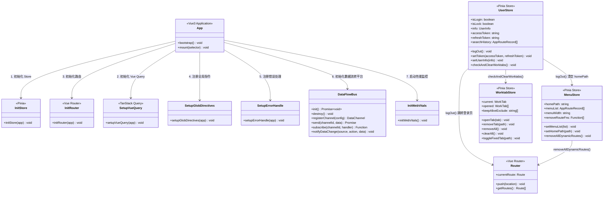

---

## 2. API 服务层

全部 24 个 API 模块及其端点分组。

```mermaid
classDiagram
    direction TB

    class HttpService {
        <<Axios Wrapper>>
        +get~T~(config) Promise~T~
        +post~T~(config) Promise~T~
        +put~T~(config) Promise~T~
        +del~T~(config) Promise~T~
        +request~T~(config) Promise~T~
        -axiosInstance: AxiosInstance
        -requestInterceptor() void
        -responseInterceptor() void
    }

    class AuthAPI {
        <<auth.ts>>
        +fetchLogin(params) Promise
        +fetchLogout() Promise
        +fetchRefreshToken() Promise
        +fetchGetUserInfo() Promise
    }

    class ProjectAPI {
        <<project.ts>>
        +fetchGetProjectList(params) Promise
        +fetchGetProjectDetail(id) Promise
        +fetchCreateProject(params) Promise
        +fetchUpdateProject(id, params) Promise
        +fetchDeleteProject(id) Promise
        +fetchCopyProject(id) Promise
        +fetchGetProjectMembers(id) Promise
        +fetchAddProjectMember(id, params) Promise
        +fetchGetProjectConfig(id) Promise
        +fetchGetReviewConfig(id) Promise
        +fetchGetProjectStatistics(id) Promise
    }

    class ScriptAPI {
        <<script.ts>>
        +fetchGetScriptList(projectId, params) Promise
        +fetchGetScriptDetail(id) Promise
        +fetchCreateScript(projectId, params) Promise
        +fetchUpdateScript(id, params) Promise
        +fetchDeleteScript(id) Promise
        +fetchSubmitScriptReview(id) Promise
        +fetchDecomposeScript(projectId, id) Promise
        +fetchGetProjectEpisodes(projectId) Promise
        +fetchGenerateCharacterProfiles(...) Promise
        +fetchExtractAssets(...) Promise
        +fetchGenerateStyleConfig(...) Promise
        +fetchReviewScriptContent(...) Promise
    }

    class StoryboardAPI {
        <<storyboard.ts>>
        +fetchGetStoryboardList(projectId, params) Promise
        +fetchGetStoryboardDetail(id) Promise
        +fetchCreateStoryboard(projectId, params) Promise
        +fetchUpdateStoryboard(id, params) Promise
        +fetchDeleteStoryboard(id) Promise
        +fetchBatchDeleteStoryboards(ids) Promise
        +fetchSubmitStoryboardReview(id) Promise
        +fetchDecomposeStoryboard(...) Promise
        +fetchGetSceneList(episodeId) Promise
        +fetchReorderStoryboards(sceneId, ids) Promise
    }

    class TeamAPI {
        <<team.ts>>
        +fetchGetMyTeams() Promise
        +fetchGetTeamDetail(teamId) Promise
        +fetchSwitchTeam(teamId) Promise
        +fetchGetTeamMembers(teamId, params) Promise
        +fetchGetTeamRoles(teamId) Promise
        +fetchCreateTeamRole(teamId, params) Promise
        +fetchGetInviteCodes(teamId) Promise
        +fetchCreateInviteCode(teamId, params) Promise
        +fetchGetJoinApplications(teamId) Promise
        +fetchTransferOwnership(teamId, newOwnerId) Promise
    }

    class ReviewAPI {
        <<review.ts>>
        +fetchGetReviewList(params) Promise
        +fetchGetReviewDetail(id) Promise
        +fetchCreateReview(params) Promise
        +fetchClaimReview(id) Promise
        +fetchReviewDecision(params) Promise
        +fetchBatchReviewDecision(params) Promise
        +fetchWithdrawReview(id) Promise
        +fetchArchiveReview(id) Promise
        +fetchGetPendingReviewCount() Promise
        +fetchGetMySubmissions(params) Promise
        +fetchGetReviewStatistics(projectId) Promise
    }

    class WorkflowAPI {
        <<workflow.ts>>
        +fetchExecuteWorkflow(code, params) Promise
        +fetchExecuteWorkflowStream(code, params, callbacks) Promise~AbortController~
        +fetchStopWorkflow(code, taskId) Promise
        +fetchMultimodalExecute(params) Promise
        +fetchMultimodalExecuteStream(params, callbacks) Promise
        +fetchExecuteWorkflowChain(params) Promise
        +fetchStyleInference(params) Promise
        +fetchGetWorkflowCatalog() Promise
    }

    class AssetAPI {
        <<asset.ts>>
        +fetchGetProjectAssets(projectId, params) Promise
        +fetchUploadAsset(projectId, params) Promise
        +fetchDeleteAsset(projectId, assetId) Promise
        +fetchBatchDeleteAssets(projectId, ids) Promise
        +fetchDownloadAsset(projectId, assetId) Promise
        +fetchInitChunkUpload(projectId, params) Promise
        +fetchAiGenerateAsset(projectId, params) Promise
        +fetchImportFromTeam(projectId, ids) Promise
        +fetchGetTeamAssets(teamId, params) Promise
    }

    class VideoAPI {
        <<video.ts>>
        +fetchSubmitVideoGeneration(params) Promise
        +fetchGetVideoTaskList(params) Promise
        +fetchGetVideoTaskResult(taskId) Promise
        +fetchCancelVideoTask(taskId) Promise
        +fetchGenerateVideoPrompts(...) Promise
        +fetchCheckVideoPromptViolation(...) Promise
    }

    class ImageAPI {
        <<image.ts>>
        +fetchSubmitImageGeneration(params) Promise
        +fetchGetImageTaskStatus(taskId) Promise
        +fetchGetImageTaskResult(taskId) Promise
        +fetchGetImageModels() Promise
    }

    class CharacterAPI {
        <<character.ts>>
        +fetchGetCharacterList(projectId) Promise
        +fetchCreateCharacter(projectId, data) Promise
        +fetchUpdateCharacter(projectId, id, data) Promise
        +fetchDeleteCharacter(projectId, id) Promise
        +fetchLinkCharacterToStoryboard(...) Promise
        +fetchGetCharactersByStoryboard(...) Promise
    }

    class NotificationAPI {
        <<notification.ts>>
        +fetchGetNotificationList(params) Promise
        +fetchGetUnreadCount() Promise
        +fetchMarkAsRead(id) Promise
        +fetchMarkAllAsRead() Promise
        +fetchDeleteNotification(id) Promise
        +fetchGetNotificationPreference() Promise
        +fetchGetWsToken() Promise
    }

    class PointsAPI {
        <<points.ts>>
        +fetchGetMyCredits() Promise
        +fetchGetProjectCredits(projectId) Promise
        +fetchGetPricingList() Promise
        +fetchGetMyTokenUsage() Promise
        +fetchGetTeamTokenUsage(teamId) Promise
    }

    class AiProcessAPI {
        <<ai-process.ts>>
        +fetchGetAiProcessStatus(params) Promise
        +fetchGetAiProcessHistory(params) Promise
        +fetchGetAiProcessHistoryDetail(id) Promise
    }

    class BillingAPI {
        <<billing.ts>>
        +fetchGetBillingInfo() Promise
        +fetchGetInvoiceList(params) Promise
    }

    class EditorAPI {
        <<editor.ts>>
        +fetchGetEditorConfig() Promise
        +fetchSaveEditorState(state) Promise
    }

    class DataHistoryAPI {
        <<data-history.ts>>
        +fetchGetHistoryList(params) Promise
        +fetchGetHistoryDetail(id) Promise
    }

    class ScriptAssetAPI {
        <<script-asset.ts>>
        +fetchGetScriptAssetList(params) Promise
        +fetchUploadScriptAsset(params) Promise
    }

    class StatisticsAPI {
        <<statistics.ts>>
        +fetchGetDashboardStats() Promise
        +fetchGetProjectStats(projectId) Promise
    }

    class SystemManageAPI {
        <<system-manage.ts>>
        +fetchGetSystemInfo() Promise
        +fetchGetUserList(params) Promise
    }

    class PlatformAdminAPI {
        <<platform-admin.ts>>
        +fetchGetPlatformConfig() Promise
        +fetchUpdatePlatformConfig(params) Promise
    }

    class SystemConfigAPI {
        <<system-config.ts>>
        +fetchGetConfig(key) Promise
        +fetchSetConfig(key, value) Promise
    }

    class WorkflowManageAPI {
        <<workflow-manage.ts>>
        +fetchGetWorkflowList(params) Promise
        +fetchCreateWorkflow(params) Promise
        +fetchUpdateWorkflow(id, params) Promise
        +fetchDeleteWorkflow(id) Promise
    }

    class VideoModelAPI {
        <<video-model.ts>>
        +fetchGetVideoModelList() Promise
        +fetchGetVideoModelDetail(id) Promise
    }

    HttpService <.. AuthAPI : uses
    HttpService <.. ProjectAPI : uses
    HttpService <.. ScriptAPI : uses
    HttpService <.. StoryboardAPI : uses
    HttpService <.. TeamAPI : uses
    HttpService <.. ReviewAPI : uses
    HttpService <.. WorkflowAPI : uses
    HttpService <.. AssetAPI : uses
    HttpService <.. VideoAPI : uses
    HttpService <.. ImageAPI : uses
    HttpService <.. CharacterAPI : uses
    HttpService <.. NotificationAPI : uses
    HttpService <.. PointsAPI : uses
    HttpService <.. AiProcessAPI : uses
    HttpService <.. BillingAPI : uses
    HttpService <.. EditorAPI : uses
    HttpService <.. DataHistoryAPI : uses
    HttpService <.. ScriptAssetAPI : uses
    HttpService <.. StatisticsAPI : uses
    HttpService <.. SystemManageAPI : uses
    HttpService <.. PlatformAdminAPI : uses
    HttpService <.. SystemConfigAPI : uses
    HttpService <.. WorkflowManageAPI : uses
    HttpService <.. VideoModelAPI : uses
```

---

## 3. 数据流转平台

统一数据流转平台的内部架构。

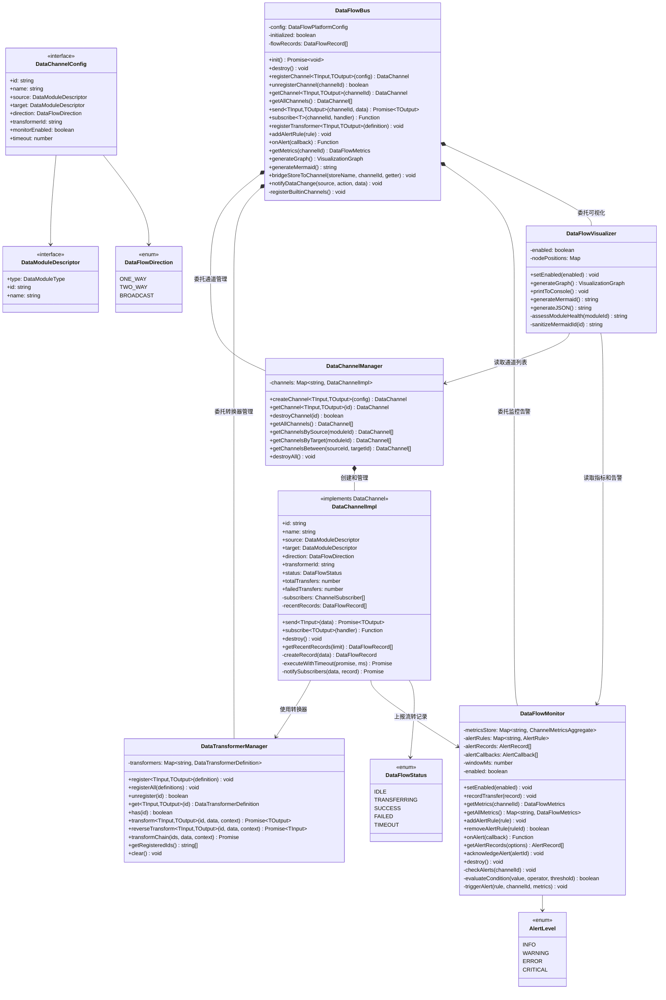

---

## 4. 数据模型

核心领域实体及其关系。

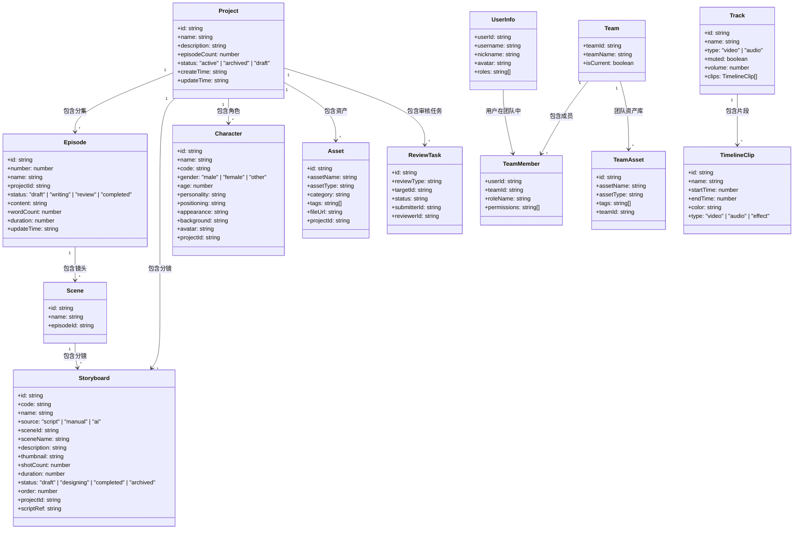

---

## 5. 用户认证

登录流程、Token 管理和登出级联清理。

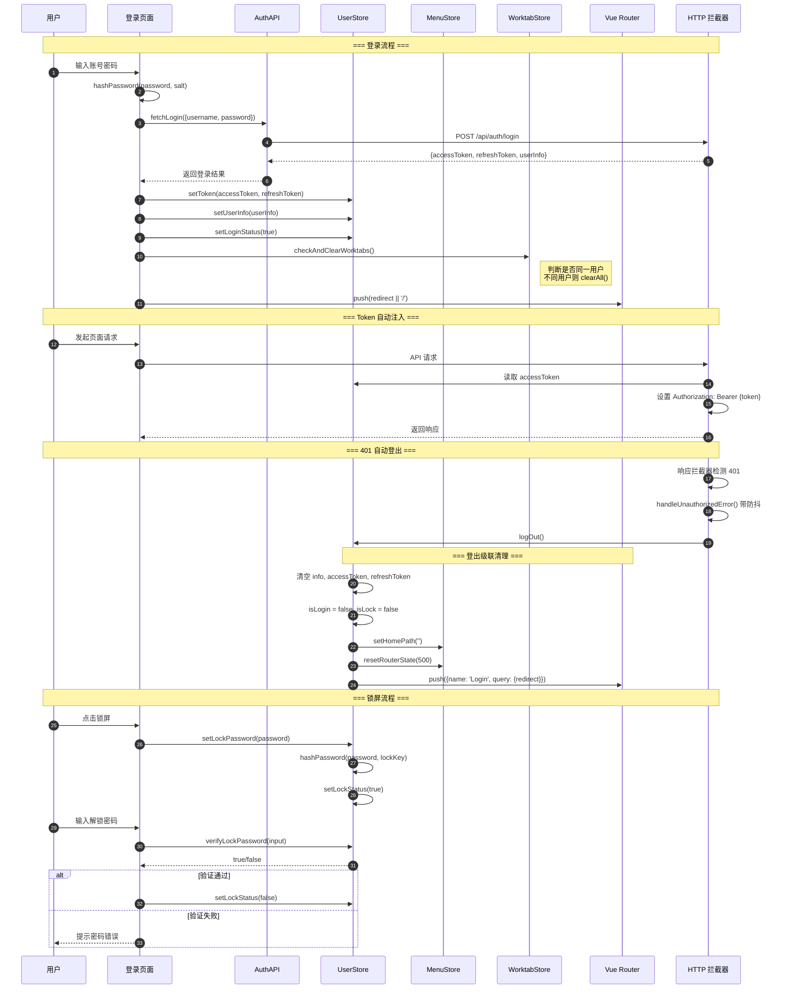

---

## 6. 项目数据流转

加载顺序：项目详情、剧本、分集、分镜。

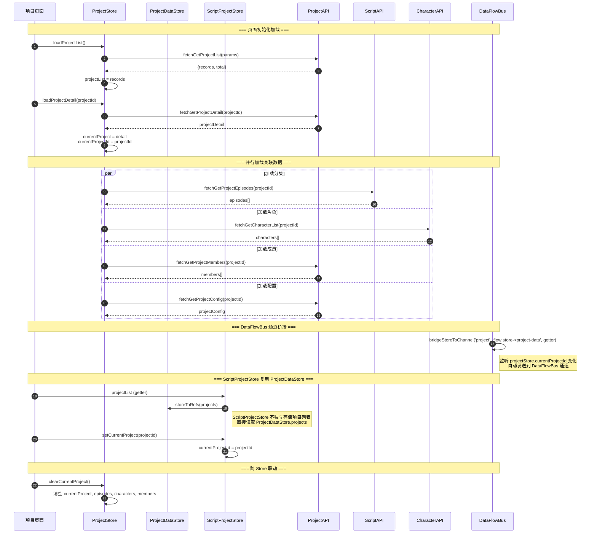

---

## 7. 审核工作流

提交、认领和决策审核任务。

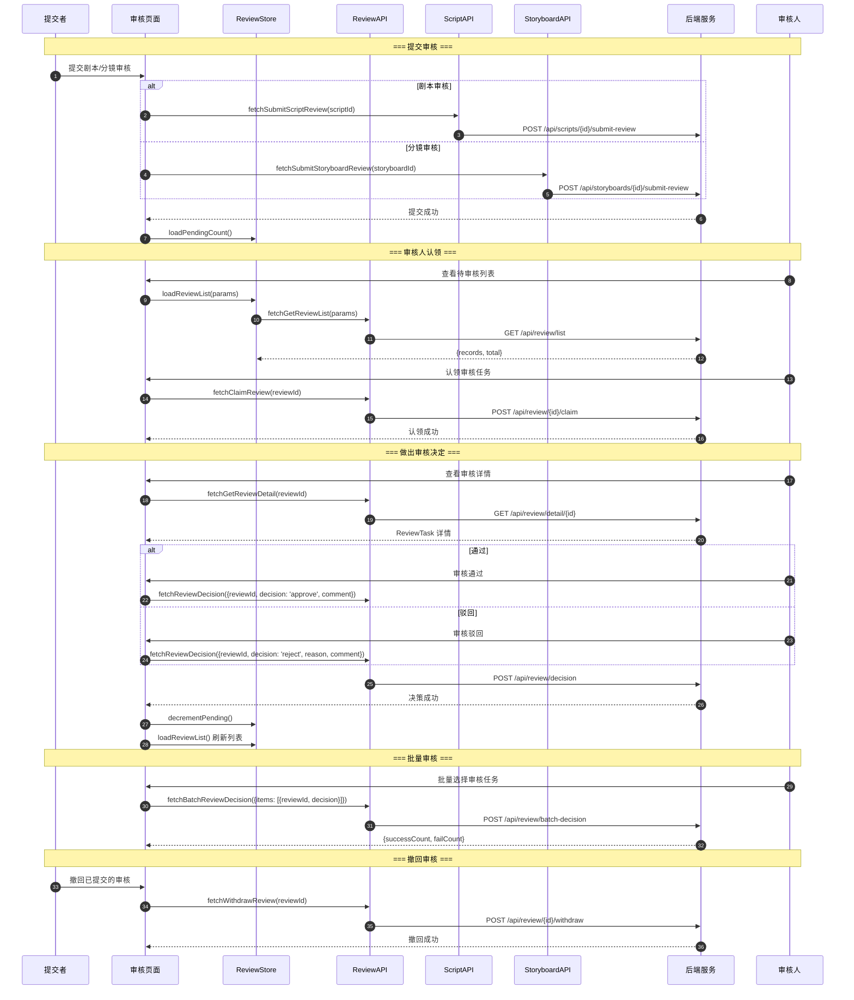

---

## 8. 工作流 SSE 执行

工作流执行的 SSE 流式通信。

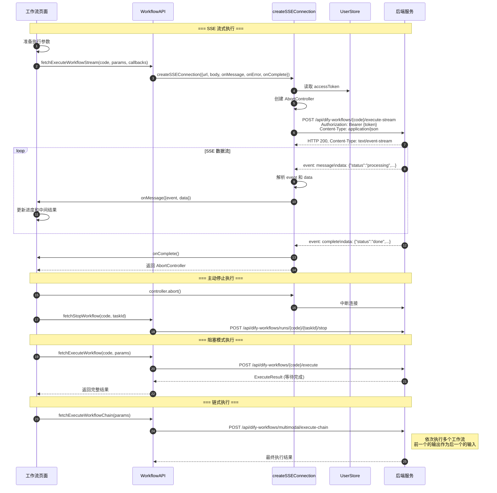

---

## 9. 数据流转平台组件图

数据流转平台与应用模块的集成方式。

```mermaid
graph TB
    subgraph "应用层 (Application Layer)"
        Pages["页面组件<br/>ProjectList, ScriptList,<br/>AssetLibrary, ReviewPending..."]
        Components["公共组件<br/>Forms, Tables, Charts..."]
    end

    subgraph "状态管理层 (Store Layer)"
        US["UserStore"]
        PS["ProjectStore"]
        PDS["ProjectDataStore"]
        SPS["ScriptProjectStore"]
        TS["TeamStore"]
        RS["ReviewStore"]
        NS["NotificationStore"]
        MS["MenuStore"]
        WS["WorktabStore"]
        STS["SettingStore"]
    end

    subgraph "API 服务层 (API Layer)"
        AuthAPI["AuthAPI"]
        ProjectAPI["ProjectAPI"]
        ScriptAPI["ScriptAPI"]
        StoryboardAPI["StoryboardAPI"]
        TeamAPI["TeamAPI"]
        ReviewAPI["ReviewAPI"]
        WorkflowAPI["WorkflowAPI"]
        AssetAPI["AssetAPI"]
        VideoAPI["VideoAPI"]
        ImageAPI["ImageAPI"]
        CharAPI["CharacterAPI"]
        NotifAPI["NotificationAPI"]
        PointsAPI["PointsAPI"]
        AiAPI["AiProcessAPI"]
        Others["BillingAPI, EditorAPI,<br/>DataHistoryAPI, ScriptAssetAPI,<br/>StatisticsAPI, SystemManageAPI,<br/>PlatformAdminAPI, SystemConfigAPI,<br/>WorkflowManageAPI, VideoModelAPI"]
    end

    subgraph "DataFlow 数据流转平台"
        Bus["DataFlowBus<br/>核心总线"]
        CM["ChannelManager<br/>通道管理器"]
        TM["TransformerManager<br/>转换器管理器"]
        Monitor["Monitor<br/>监控告警"]
        Vis["Visualizer<br/>可视化"]
    end

    subgraph "内置通道 (Builtin Channels)"
        Ch1["flow:api->project-list"]
        Ch2["flow:api->script-list"]
        Ch3["flow:api->asset-list"]
        Ch4["flow:api->review-list"]
        Ch5["flow:api->workflow-list"]
        Ch6["flow:api->team-list"]
        Ch7["flow:store->user-info<br/>(broadcast)"]
        Ch8["flow:store->settings<br/>(broadcast)"]
        Ch9["flow:store->project-data<br/>(two-way)"]
        Ch10["flow:page->api:form-submit"]
        Ch11["flow:event-bus:global<br/>(broadcast)"]
    end

    subgraph "内置转换器 (Builtin Transformers)"
        T1["builtin:date-format<br/>日期格式化"]
        T2["builtin:pagination-params<br/>分页参数转换"]
        T3["builtin:pagination-response<br/>分页响应转换"]
        T4["builtin:sanitize-empty<br/>空值清洗"]
    end

    subgraph "HTTP 基础设施"
        Axios["Axios 实例<br/>拦截器, 重试, 缓存"]
        SSE["SSE 连接<br/>createSSEConnection"]
    end

    Pages -->|"调用 Actions"| US
    Pages -->|"调用 Actions"| PS
    Pages -->|"调用 Actions"| RS
    Pages -->|"subscribe(chId)"| Bus

    US -->|"fetchLogin/Logout"| AuthAPI
    PS -->|"fetchProject*"| ProjectAPI
    PS -->|"fetchEpisodes"| ScriptAPI
    RS -->|"fetchReview*"| ReviewAPI
    TS -->|"fetchTeam*"| TeamAPI
    NS -->|"fetchNotif*"| NotifAPI

    Bus --> CM
    Bus --> TM
    Bus --> Monitor
    Bus --> Vis

    CM --> Ch1
    CM --> Ch2
    CM --> Ch3
    CM --> Ch4
    CM --> Ch5
    CM --> Ch6
    CM --> Ch7
    CM --> Ch8
    CM --> Ch9
    CM --> Ch10
    CM --> Ch11

    TM --> T1
    TM --> T2
    TM --> T3
    TM --> T4

    ProjectAPI --> Axios
    ScriptAPI --> Axios
    WorkflowAPI --> SSE
    Axios -->|"Bearer Token"| US

    Bus -.->|"bridgeStoreToChannel"| TS
    Bus -.->|"bridgeStoreToChannel"| NS
    Bus -.->|"bridgeStoreToChannel"| RS
    Bus -.->|"bridgeStoreToChannel"| PS
```

---

## 10. Store 依赖关系图

Pinia Store 模块依赖和跨 Store 交互。

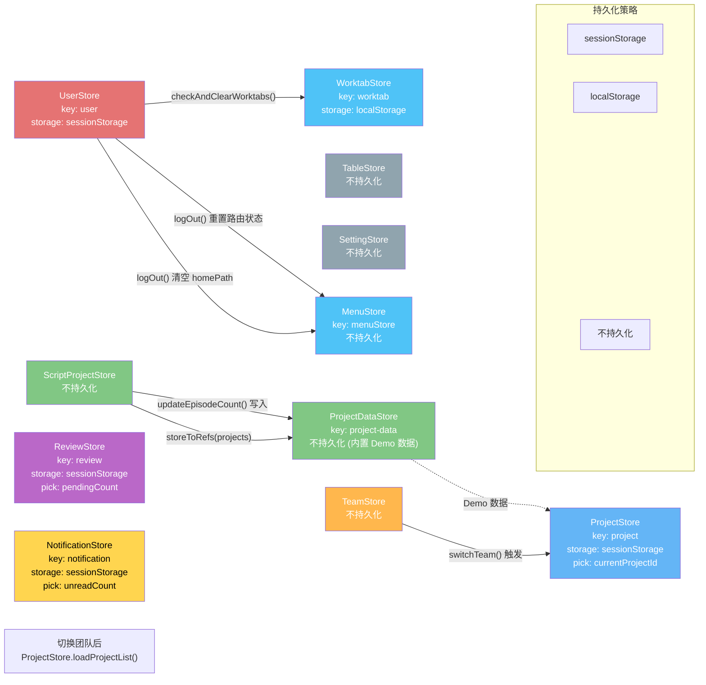

---

## 11. 业务模块分解

项目所有业务模块及其子模块的完整分解。

```mermaid
classDiagram
    direction TB

    class 项目管理模块 {
        +项目列表 list/
        +项目创建 create/
        +项目编辑 edit/
        +项目成员 member/
        +项目设置 settings/
        +项目统计 statistics/
        +分集管理 episodes/
        +角色管理 characters/
    }

    class 剧本管理模块 {
        +剧本库 library/
        +剧本编写 write/
        +剧本拆解 decompose/
        +人物小传 profiles/
        +版本管理 version/
        +AI审核 ai-review/
    }

    class 分镜管理模块 {
        +分镜设计 design/
        +分镜预览 preview/
        +镜头管理 scene/
        +批量编辑 batch-edit/
    }

    class 团队管理模块 {
        +团队列表 list/
        +团队成员 members/
        +团队角色 roles/
        +邀请码 invite-codes/
        +加入申请 applications/
        +团队设置 settings/
        +配额管理 quota/
    }

    class 审核系统模块 {
        +待审核列表 pending/
        +审核详情 detail/
        +审核内容 content/
        +审核流程 flow/
        +驳回原因 reject-reasons/
        +审核统计 statistics/
    }

    class 工作流引擎模块 {
        +工作流目录 catalog/
        +工作流列表 list/
        +工作流执行 execute/
    }

    class 资产管理模块 {
        +资产库 library/
        +资产上传 upload/
        +资产分类 category/
        +资产标签 tags/
        +资产导入 import/
        +资产复用 reuse/
        +资产预览 preview/
        +AI生成 ai-generate/
    }

    class 视频生成模块 {
        +AI生成 ai/
        +任务管理 task/
        +生成历史 history/
        +视频预览 preview/
    }

    class 图片生成模块 {
        +图片生成 generate/
        +任务管理 tasks/
        +模型管理 models/
    }

    class 积分系统模块 {
        +积分记录 record/
        +交易流水 transactions/
        +定价管理 pricing/
        +账单管理 billing/
        +Token用量 token-usage/
    }

    class 统计分析模块 {
        +统计看板 dashboard/
        +用量统计 usage/
        +成本分析 cost/
        +AI用量 ai-usage/
        +报表管理 report/
        +数据分析 analysis/
    }

    class 系统管理模块 {
        +用户管理 user/
        +角色管理 role/
        +菜单管理 menu/
        +平台团队 platform-teams/
        +工作流管理 dify-workflows/
        +视频模型 video-models/
        +计费配置 billing-config/
        +运行配置 runtime-config/
        +审计日志 audit-logs/
        +管理看板 admin-dashboard/
    }

    class 通知模块 {
        +站内通知 site/
        +消息提醒 remind/
    }

    class 编辑器模块 {
        +编辑管理 edit-manage/
        +时间线 timeline/
        +导出 export/
    }

    class AI处理模块 {
        +处理状态 status/
        +处理历史 history/
    }

    class 数据历史模块 {
        +历史记录 records/
        +版本回滚 rollback/
    }

    class 设置模块 {
        +账号设置 account/
        +安全设置 security/
        +系统设置 system/
        +危险操作 danger/
    }
```

---

## 12. 模块间数据交换关系

核心模块之间的数据流向和依赖关系。

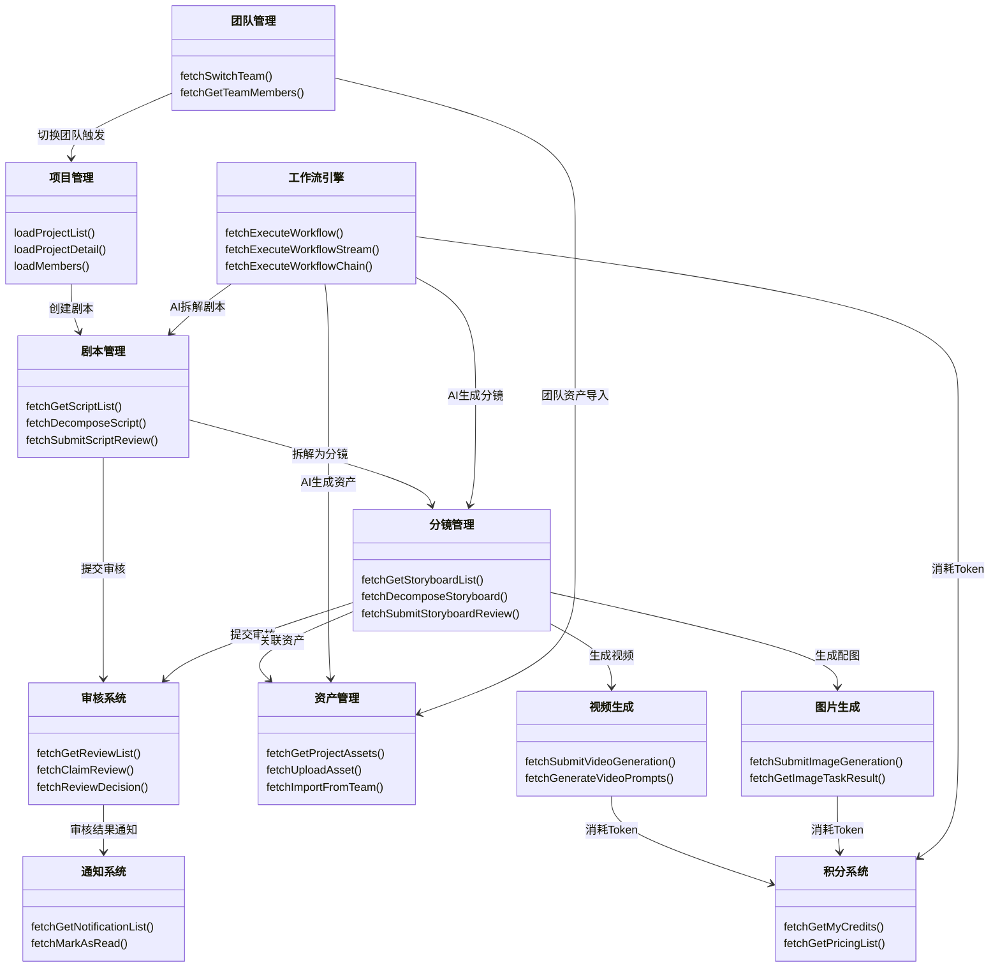

---

## 13. 项目管理子模块数据流

项目管理模块内部子模块间的数据流转。

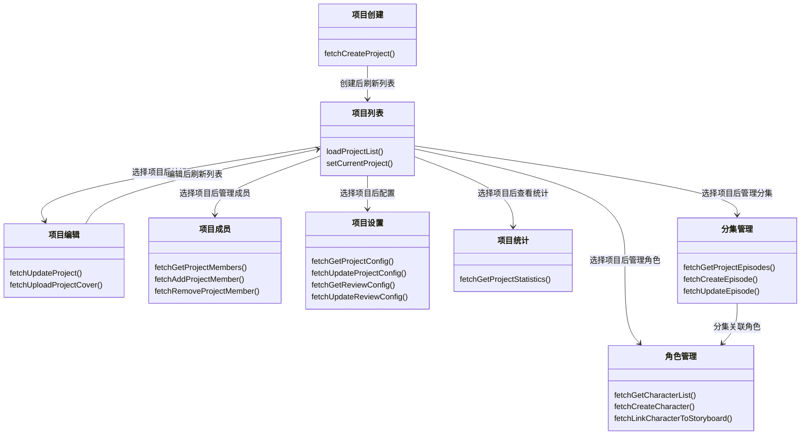

---

## 附录：内置数据流转通道

| 通道ID | 源模块 | 目标模块 | 流转方向 | 转换器 |
|---|---|---|---|---|
| `flow:api->project-list` | ProjectAPI | 项目列表页 | 单向 | pagination-response |
| `flow:api->script-list` | ScriptAPI | 剧本列表页 | 单向 | pagination-response |
| `flow:api->asset-list` | AssetAPI | 资产库页 | 单向 | pagination-response |
| `flow:api->review-list` | ReviewAPI | 待审核页 | 单向 | pagination-response |
| `flow:api->workflow-list` | WorkflowAPI | 工作流列表页 | 单向 | pagination-response |
| `flow:api->team-list` | TeamAPI | 团队列表页 | 单向 | pagination-response |
| `flow:store->user-info` | UserStore | 全部页面 | 广播 | - |
| `flow:store->settings` | SettingStore | 全部组件 | 广播 | - |
| `flow:store->project-data` | ProjectDataStore | 项目相关页面 | 双向 | - |
| `flow:page->api:form-submit` | 页面表单 | API 服务 | 单向 | sanitize-empty |
| `flow:event-bus:global` | 全局事件总线 | 全部组件 | 广播 | - |

## 附录：内置数据转换器

| 转换器ID | 名称 | 描述 |
|---|---|---|
| `builtin:date-format` | 日期格式化 | ISO 8601 -> zh-CN 本地化字符串 |
| `builtin:pagination-params` | 分页参数转换 | {current, size} -> {page, pageSize} |
| `builtin:pagination-response` | 分页响应转换 | 后端分页格式 -> {records, total, current, size} |
| `builtin:sanitize-empty` | 空值清洗 | 移除空字符串、空数组、空对象和 null/undefined |

## 附录：内置告警规则

| 规则ID | 名称 | 条件 | 级别 | 冷却时间 |
|---|---|---|---|---|
| `builtin:high-error-rate` | 高错误率 | errorRate > 50% | ERROR | 30s |
| `builtin:slow-transfer` | 慢流转 | avgDuration > 3000ms | WARNING | 60s |
| `builtin:high-p95` | P95 高延迟 | p95Duration > 10000ms | WARNING | 60s |

## 附录：Store 持久化策略汇总

| Store名称 | 存储键 | 存储方式 | 持久化字段 |
|---|---|---|---|
| UserStore | `user` | sessionStorage | (全部字段) |
| ProjectStore | `project` | sessionStorage | currentProjectId |
| ReviewStore | `review` | sessionStorage | pendingCount |
| NotificationStore | `notification` | sessionStorage | unreadCount |
| WorktabStore | `worktab` | localStorage | (全部字段) |
| ProjectDataStore | - | - | (不持久化, 内置数据) |
| ScriptProjectStore | - | - | (不持久化) |
| TeamStore | - | - | (不持久化) |
| MenuStore | - | - | (不持久化) |
| SettingStore | - | - | (不持久化) |
| TableStore | - | - | (不持久化) |
